LoG, 22    
[A Generalist Neural Algorithmic Learner](https://arxiv.org/abs/2209.11142)
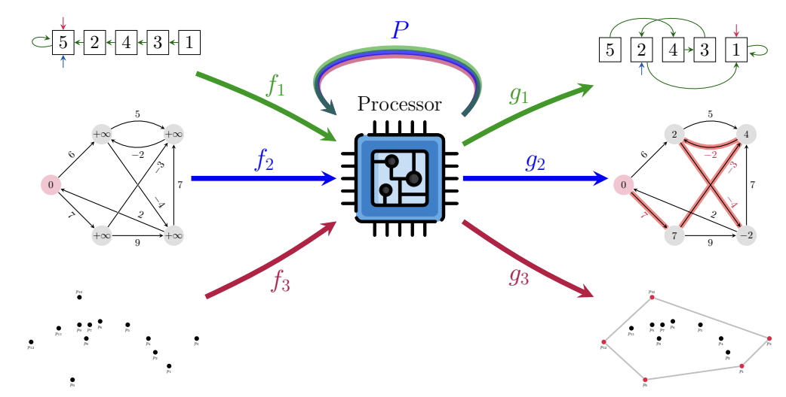

# Summary
- Neural network, 그 중에서도 GNN은 전통적인 컴퓨터과학 알고리즘(CLRS 책에 기재된)을 학습할 수 있다.
- 필요한 algorithm이 간단하지 않을 경우, generalist neural algorithmic learner가 필요하다.
- 안정적인 multi-task learning에 있어서 chunking mechanism이 중요했다.

## Starting point: A benchmark to train neural computer scientists

[The CLRS Algorithmic Reasoning Benchmark](https://arxiv.org/abs/2205.15659)

[https://github.com/deepmind/clrs](https://github.com/deepmind/clrs)

- Neural network가 전통적인 CS algorithm을 풀도록 학습시킬 수 있을까?
- 이후에는 이 지식을 natural input에 적용해서 real-world problem을 풀 수 있을 것이다.
- 그리고, 그 algorithm을 여러 개 학습시킬 수 있을까?
- 이런 문제들은 recurrent architecture로 modeling 할 수 있다.
    - LSTM, Transformer, ConvNet, GNN 등.
    - 저자들은 GNN을 사용.

Benchmark: Introduction to Algorithms: CLRS

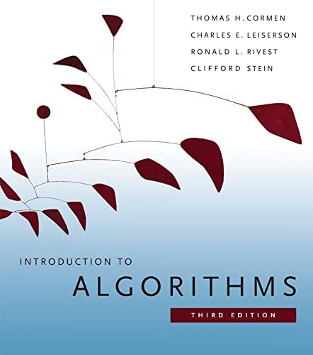
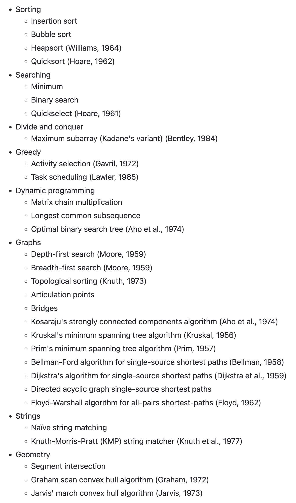

## Representation

- 모든 알고리즘은 graph 형태로 표현되었다.
- 각 알고리즘은 정해진 숫자만큼의 “probe”로 표현된다.
- 예를 들어, insertion sort 알고리즘은 아래 6가지의 probe로 구성된다.
    - `'pos': (Stage. INPUT, Location.NODE, Type.SCALAR)` → 각 node의 ID
    - `'key': (Stage.INPUT, Location. NODE, Type.SCALAR)` → 정렬할 value
    - `'pred': (Stage.OUTPUT, Location. NODE, Type.POINTER)` → 최종 node 순서
    - `'pred h': (Stage. HINT, Location. NODE, Type. POINTER)` → 실행하면서 바뀌는 node 순서
    - `'i': (Stage.HINT, Location.NODE, Type.MASK_ONE)` → insertion할 index
    - `'j': (Stage.HINT, Location.NODE, Type.MASK_ONE)` → tracking 할 index
- Probe는 input, output, hint 중 하나.
- Input과 output은 알고리즘 실행 시 고정, hint는 실행되면서 바뀜.
    - 따라서, 모든 sorting algorithm은 input과 output이 같고 hint만 다름.

## Representation: Encoding

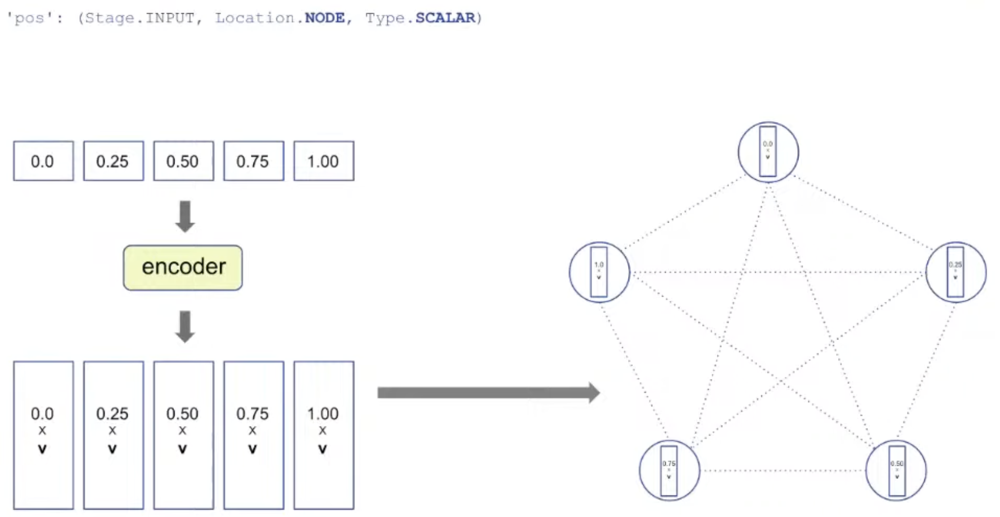

처음 positional ID (node의 ID)는 encoder에 의해 vector 형태로 표현됨.

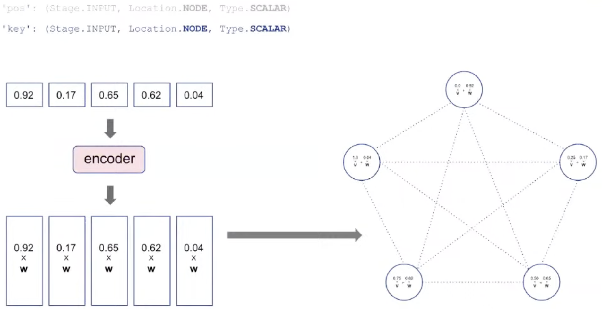

Algorithm의 대상이 되는 value도 encoder에 의해 vector 형태로 표현되고, pos에 더해짐.

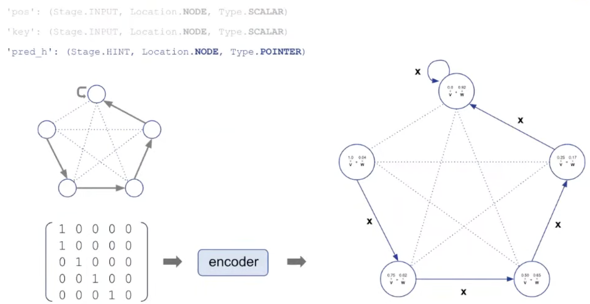

Hint로 사용되는 pred_h도 encoder에 의해 pointer로 mapping됨.

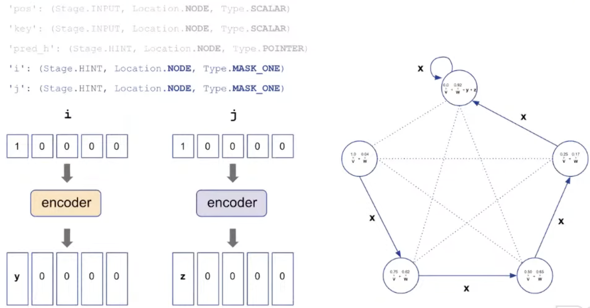

Insertion에 필요한 index도 encoder에 의해 바뀌어 더해짐.

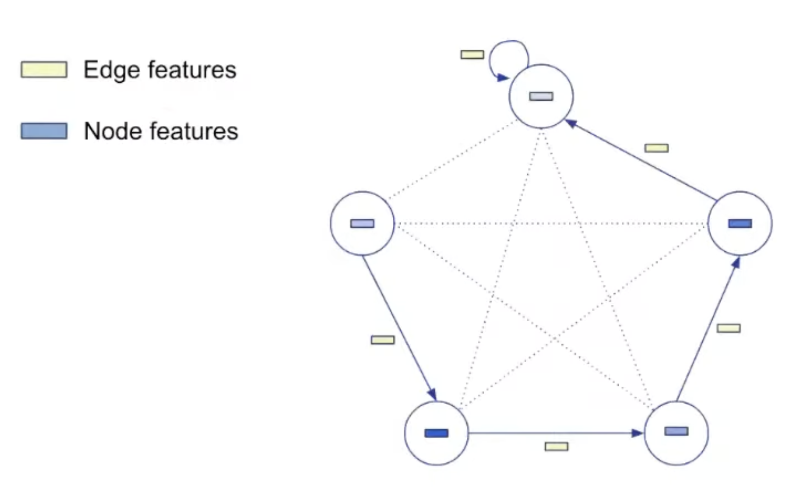

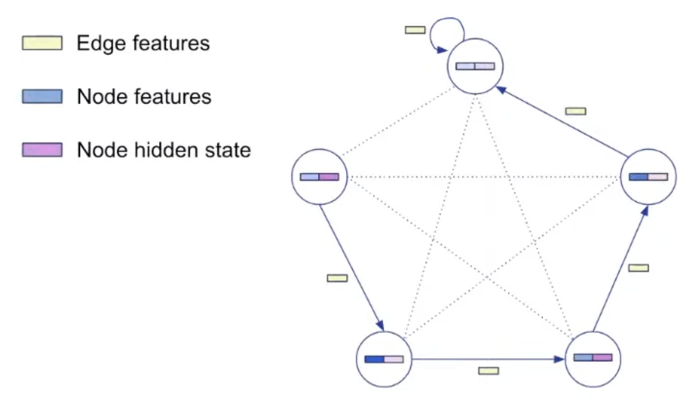

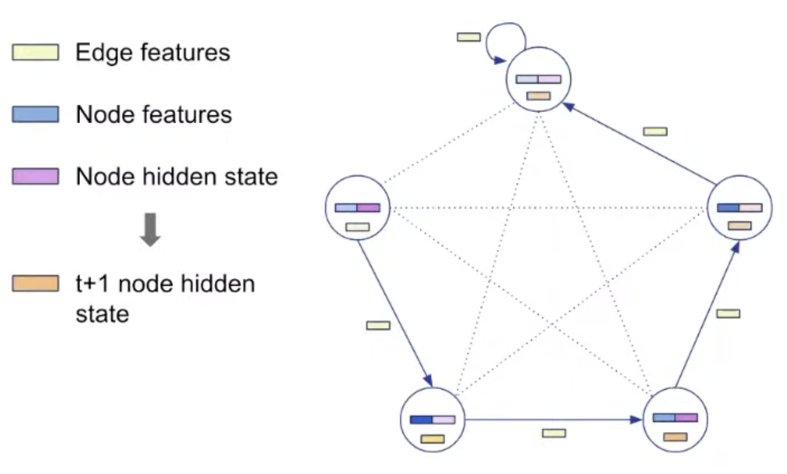

## Representation: Decoding

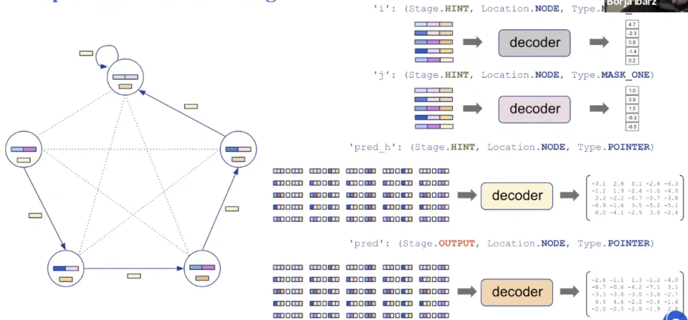

Processing step은 algorithm에 따라 바뀌지 않는다! Processing parameter는 공유됨.

## Training

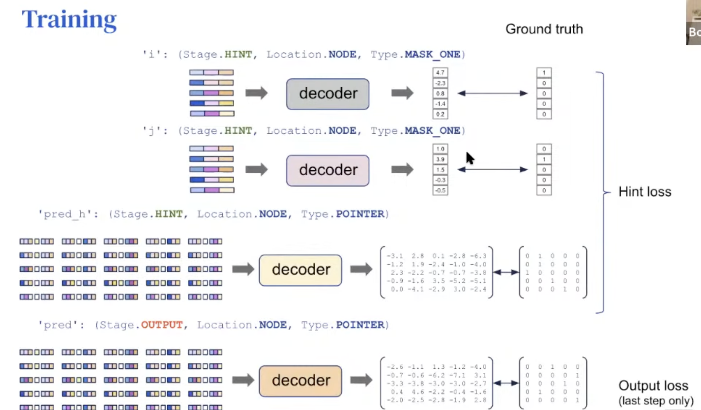

Train할 때는 hint를 사용하고, test할 때는 hint를 사용하지 않고 input만 주고 output을 맞춘다.

Train할 때는 output loss 뿐만 아니라 중간 과정인 hint loss에 대해서도 loss를 준다.

## Details

몇 가지 training detail이 실제 학습에 매우 중요했다.

Node 개수가 16이하인 graph에 대해서 train하고, node 개수가 64인 sample에 대해 test 했다.

Train, test 시 모두 trajectory의 length도 정해져있다.

In-distribution score에 따라 early stopping을 적용했다.

## Why even care about building a generalist?

왜 generalist algorithmic solver가 필요한 것일까?

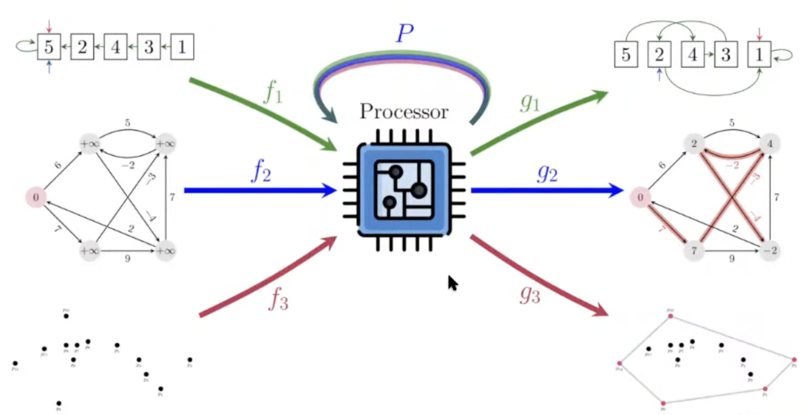

어떤 input에 대해 output을 맞추는 것은 problem solving 인데, 우리가 보통 어떻게 real-world에서 문제를 해결하고 있는지 살펴보자.

- Example: Route recommendation
    
    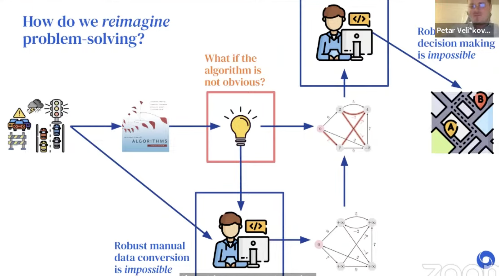
    
    Google map에서 최적의 route 추천을 해야하는 상황을 가정해보자. 그냥 raw map 상태로는 문제를 풀 수 없다. Graph 형태로 문제를 추상화한다음, CLRS에서 공부했던 알고리즘을 적용해서, (아마 대부분 Dijkstra’s algorithm을 써서) 최단 거리를 알아내고, 그것을 정답으로 하여 raw map으로 다시 변환할 것이다.
    
    하지만 real-world에서는 꼭 ‘최단거리’가 최적의 route는 아닐 수 있다. 교통상황, 높이, 등등 다양한 factor가 존재하고, 이럴 경우에는 algorithm이 obvious하지 않다.
    
    ### Details
    
    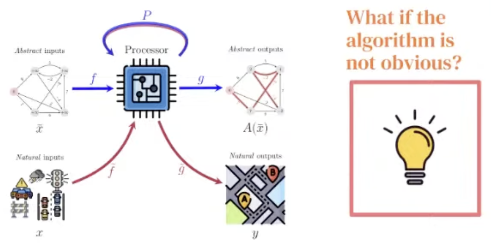
    
    저자들은 neural algorithmic reasoning으로 파란 부분의 bottleneck을 해결할 수 있다고 주장한다.
    
    그리고 잘 학습된 generalist processor가 빨간 bottleneck을 해결할 수 있다고 주장한다.
    
    - 이 generalist processor는 중요한 알고리즘의 latent space를 잘 공유한다면, 더 이상 특정 알고리즘을 고르지 않아도 되고, 최적의 정답을 추천해줄 수 있을 것이다.

## To get a generalist, first we need a good specialist!

그러나 CLRS의 30개의 알고리즘에 대해 모두 다 잘 하는 generalist를 naïve하게 학습하는 것은 어려웠다.

최근 NE++ (Xhonneux et al., NeurIPS'21) 에서, 이런 알고리즘들은 서로 연관이 높은 것들끼리 (e.g. Prim + Dijkstra) 학습될 때만 잘 학습된다는 얘기가 있었다.

DeepMind 저자들이 발견한 학습 양상:

학습이 불안정한 task 들은 다른 task에도 크게 영향을 준다.

따라서, single-task 단위로 안정성을 먼저 높여 놓아야 한다.

### Bucket list of improvements

- Teacher forcing 없애기
- Training data augmentation (16개 이하의 node size 기준)
- Soft hint propagation (hint에 대해 argmax를 취하지 않고, softmax를 취한다)
- Static hint elimination (hint가 바뀌지 않으면, input으로 사용한다)
- Encoder initialization (Xavier) + Gradient clipping
- Randomized positional embedding
- Sinkhorn operator를 사용한 Permutation decoder
- Processor에 gating mechanism
- Triplet reasoning
    
    $t_{ijk} = \psi_t (h_i, h_j, h_k, e_{ij}, e_{ik}, e_{kj}, g)$
    
    $h_{ij} = \phi_t(\max_k t_{ijk})$
    

## Results

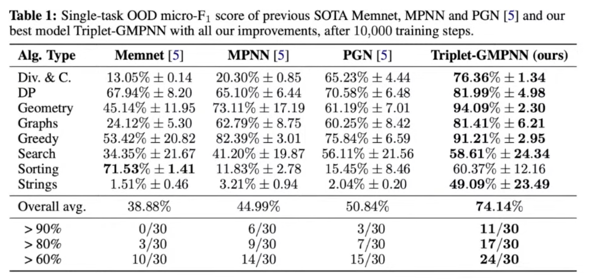

## Final step to the generalist

Multi-task learning을 위해 **chunking mechanism**이 중요했다.

1. Trajectory의 length는 16으로 설정한다.
2. 16보다 짧은 sample들은 padding 되지 않고 그냥 다음 task가 concat 된다.

즉, padding 없이 쭉 연결된 형태이며, 이렇게 구성하면 memory-efficient 하고 학습이 안정화되는 효과가 있었다.

이렇게 해도 되는 이유는 CLRS-30 task는 Markovian 이기 때문이다.

### Single generalist that matches the thirty specialists

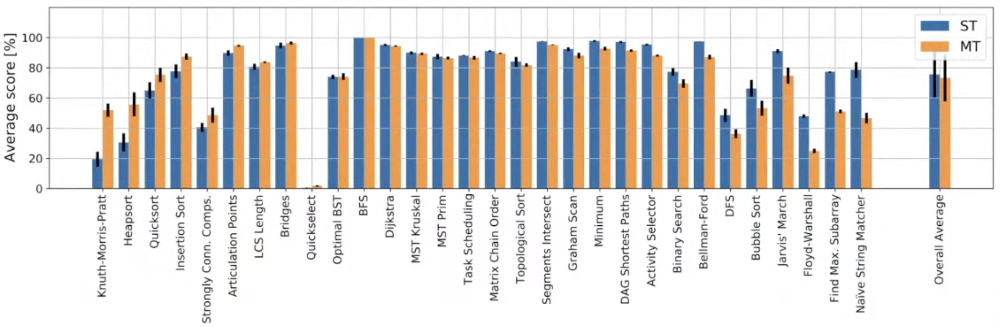

### Chunking helps significantly

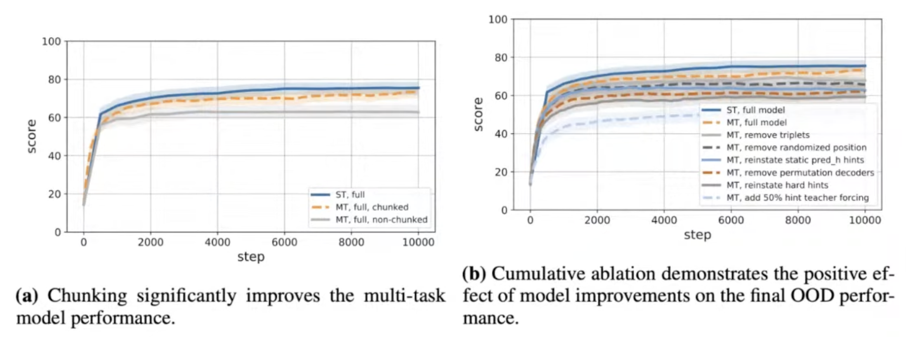

## Reference

[Learning on Graphs Conference 2022 - Day 1 Livestream](https://www.youtube.com/live/wp5S9GHyAgw?feature=share&t=10170)

[A Generalist Neural Algorithmic Learner](https://arxiv.org/abs/2209.11142)