LoG, 22    
[A Generalist Neural Algorithmic Learner](https://arxiv.org/abs/2209.11142)

# Summary
- Neural network, especially GNN, can learn traditional computer science algorithms in CLRS book.
- A generalist neural algorithmic learner is necessary if the algorithm is not obvious.
- Chunking mechanism was important to stabilize multi-task learning.

## Starting point: A benchmark to train neural computer scientists

[The CLRS Algorithmic Reasoning Benchmark](https://arxiv.org/abs/2205.15659)

[https://github.com/deepmind/clrs](https://github.com/deepmind/clrs)

- Can we train a neural network to execute classical CS algorithms?
- A differentiable computer scientist could then apply its "knowledge" to natural inputs.
- We will also ponder: can it learn multiple algorithms at the same time?
- Typically the problem is modeled with a recurrent architecture:
    - LSTMs as in, e.g., Differentiable Neural Computers
    - Transformers, as in the Universal Transformer
    - ConvNets
    - GNNs - our approach

Introduction to Algorithms: CLRS

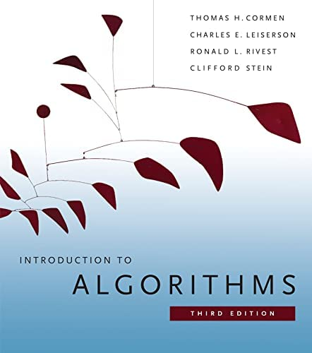
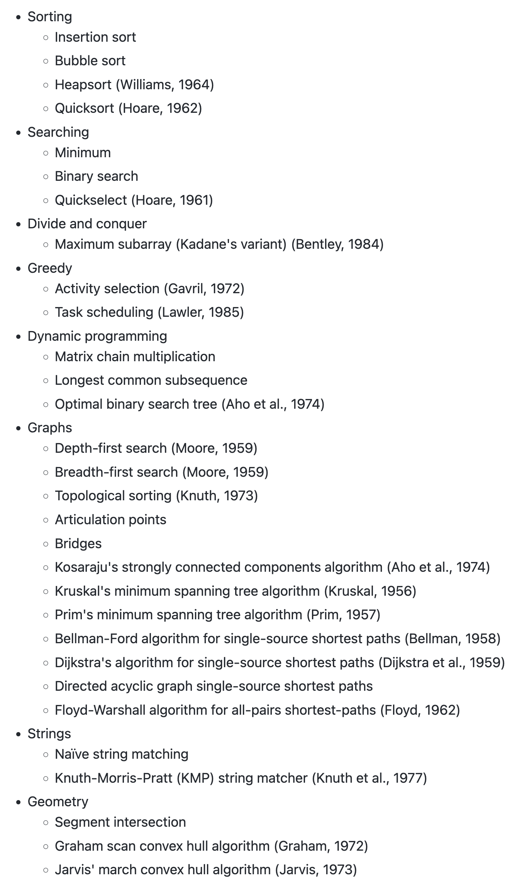

Representation

- All algorithms have been boiled down to a common graph representation
- Each algorithm is specified by a fixed number of "probes".
- For example, the spec of insertion sort consists of the following 6 probes:
    - `'pos': (Stage. INPUT, Location.NODE, Type.SCALAR)` → the id of each node
    - `'key': (Stage.INPUT, Location. NODE, Type.SCALAR)` → the values to sort
    - `'pred': (Stage.OUTPUT, Location. NODE, Type.POINTER)` → the final node order
    - `'pred h': (Stage. HINT, Location. NODE, Type. POINTER)` → the node order along execution
    - `'i': (Stage.HINT, Location.NODE, Type.MASK_ONE)` → index for insertion
    - `'j': (Stage.HINT, Location.NODE, Type.MASK_ONE)` → index tracking "sorted up to"
- A probe can be input, output or hint.
- The inputs and outputs are fixed during algorithm execution, the hints change during execution
    
    → they specify the algorithm (e.g., all sorting algorithms have the same inputs and outputs, differing only in their hints).
    

## Representation: Encoding

`pos`: Positional ID (ID of node) is encoded as vector by encoder.

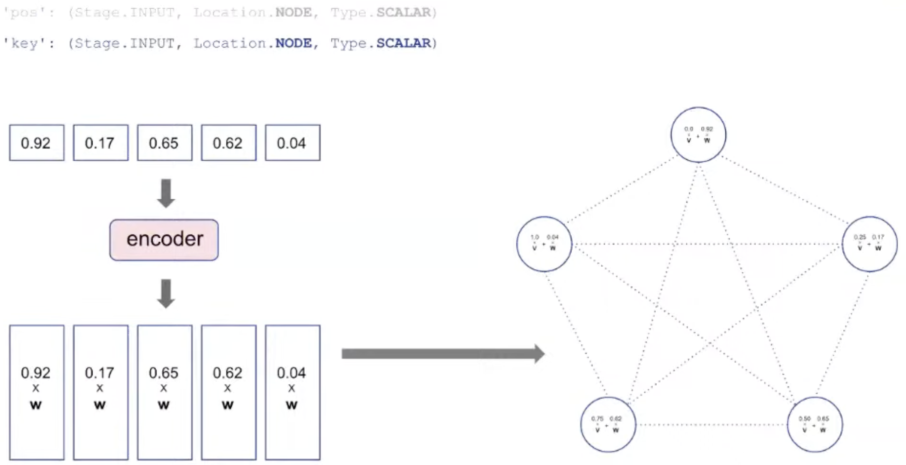

`key`: The value to be processed is also encoded as vector and added to `pos`.

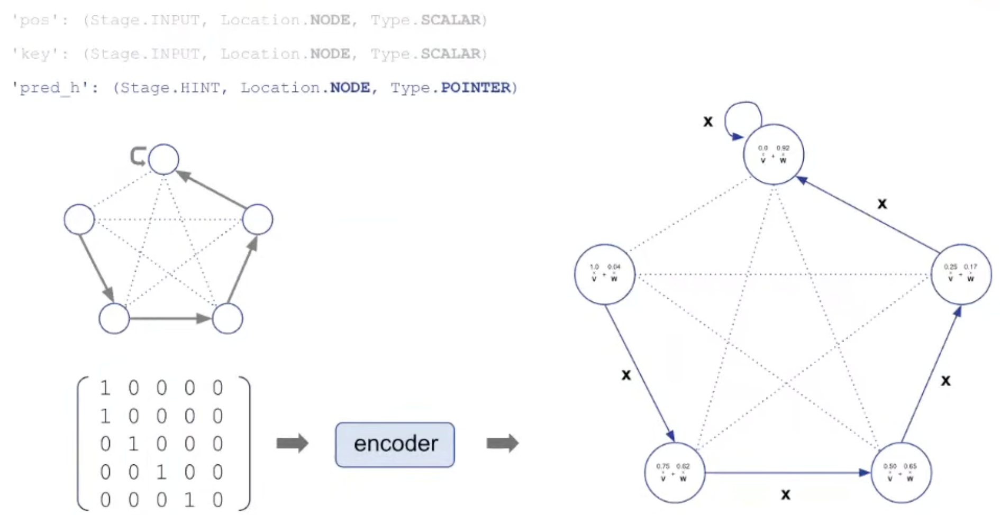

`pred_h`: pointer used as hint is encoded and used as edge embedding.

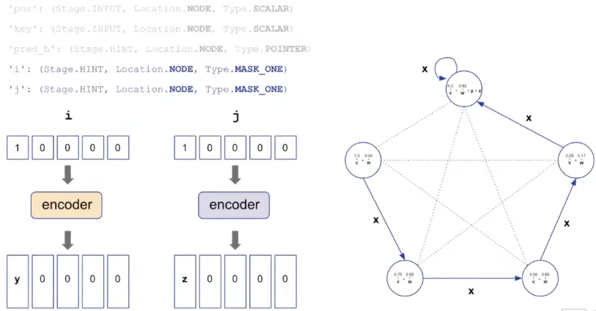

`i`, `j`: index needed for insertion are also added.

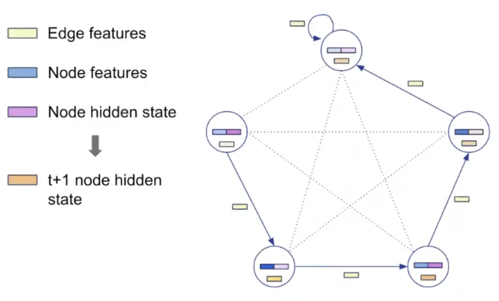

## Representation: Decoding

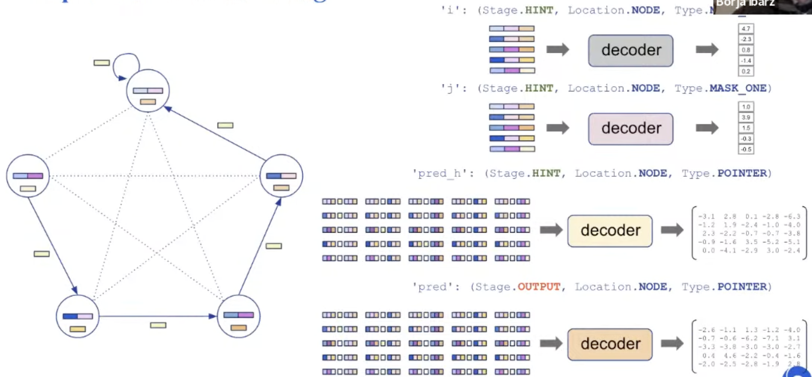

Processing step is agnostic to the algorithm. Processing parameter is shared.

## Training

Hint: used only when training (not testing)

When training, hint loss is also added along with output loss.

## Details

Trained on unlimited samples of size (number of nodes) < 16

The training distribution doesn't cover all possible inputs though (e.g., we use only
Erdös-Rényi graphs)

Tested on samples of size 64.

The length of the trajectory is given → both at train & test time.

Early stopping based on in-distribution scores.

## But.. why even care about building a generalist?

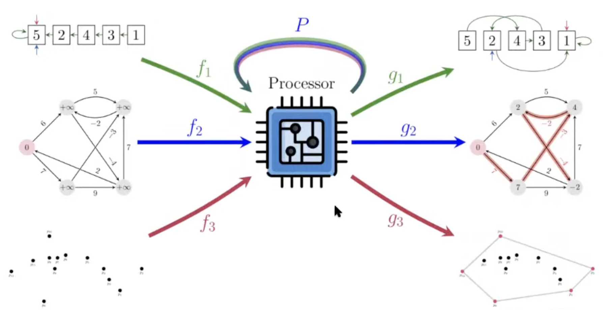

→ It is all about problem solving!

How do we solve problems?

- Example: Route recommendation
    
    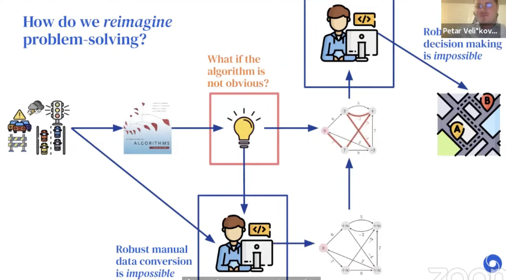
    

### Details

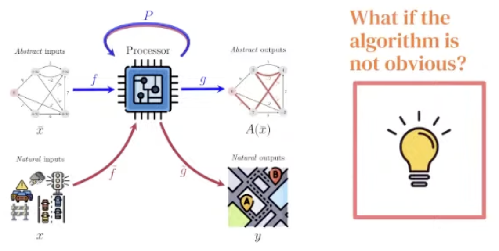

With Neural Algorithmic Reasoning, we break the **blue** bottleneck!

A generalist processor would break the **red** one!

- If the model have a shared latent space where all the "key" algorithms would be executed...
- No longer need to decide upfront which algorithm to use!
- The algorithm (combo) can be softly selected, learned by backprop through the encoder.

## To get a generalist, first we need a good specialist

However, training a generalist is not as easy as simple training over all 30 algos in CLRS-30!

Initial runs of this kind led to NaNs.

Prior results, e.g. NE++ (Xhonneux et al., NeurIPS'21) imply this can be successful only if the algorithms being learnt together are highly related (e.g. Prim + Dijkstra)..

Key limitation:

Tasks with high learning instabilities cause breakages for all other.

→ Set out to improve single-task stability first!

### Bucket list of improvements

Key improvements include:

- Removing teacher forcing
- Training data augmentation (e.g. sampling multiple sizes below 16)
- Soft hint propagation (e.g. do not apply $\argmax$ to the hints; compute $\text{softmax}$ instead)
- Static hint elimination (if a hint provably never changes, convert it to an input)
- Encoder initialization (Xavier) + gradient clipping
- Randomized positional embeddings
- Permutation decoders using the Sinkhorn operator
- Gating mechanisms in the processor
- Triplet reasoning
    
    $t_{ijk} = \psi_t (h_i, h_j, h_k, e_{ij}, e_{ik}, e_{kj}, g)$
    
    $h_{ij} = \phi_t(\max_k t_{ijk})$
    

## Results

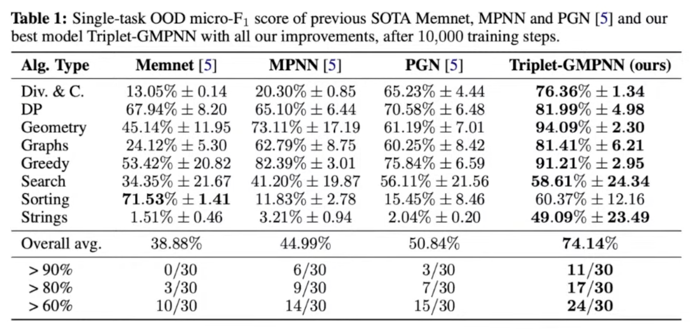

## Final step to the generalist: Chunking

The **chunking mechanism** was important for multi-task learning!

This not only helps protect against OOM issues, it also improves learning stability!

The idea is conceptually simple (though tricky to implement)

1. The length of the trajectory is set to 16.
2. Shorter samples are not padded, but concatenated by next sample.

i.e. if trajectory doesn't fully fit in the chunk, this is OK-can restart from a midpoint hint.

Initialization of the hidden state should not matter, since CLRS-30 tasks are Markovian!

### Single generalist that matches the thirty specialists

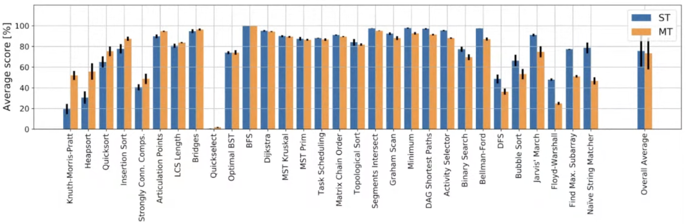

### Chunking helps significantly

## Reference

[Learning on Graphs Conference 2022 - Day 1 Livestream](https://www.youtube.com/live/wp5S9GHyAgw?feature=share&t=10170)

[A Generalist Neural Algorithmic Learner](https://arxiv.org/abs/2209.11142)