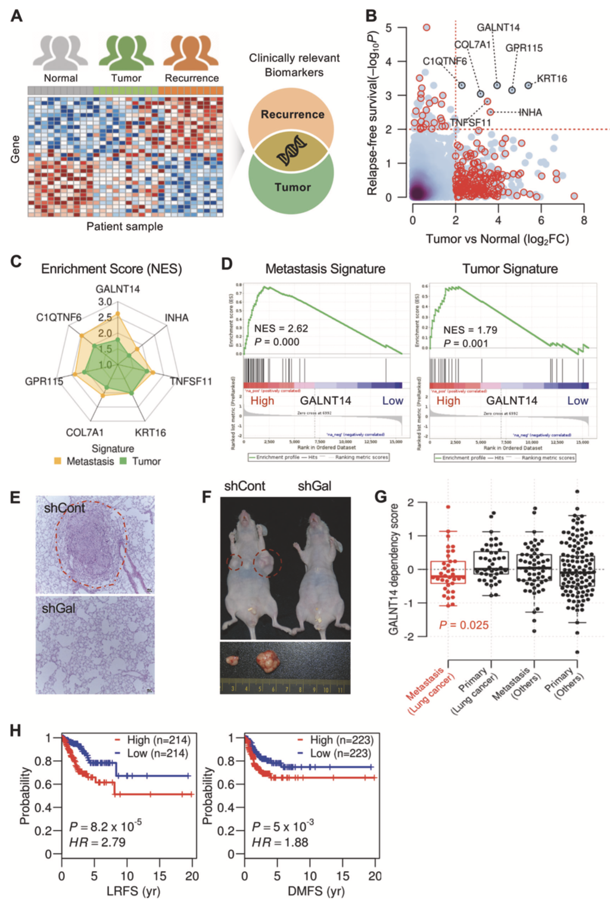
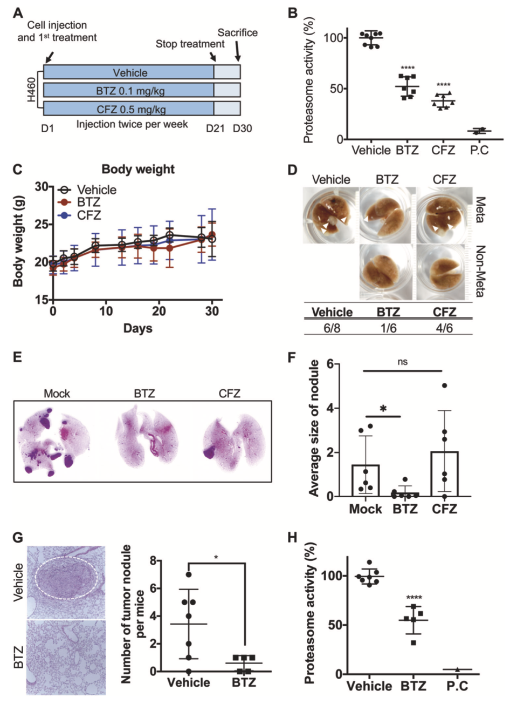

Oncogene, '20  
<https://www.nature.com/articles/s41388-020-1316-2>

# Summary
- In-silico approach based on CMap to identify drug candidates for lung cancer metastasis
- Revealed the underlying mechanisms of undruggable target (GALNT14) and targeted the downstream transcription factor
- Repositioned drug: BTZ (Bortezomib)
- Integrated multiple independent expression signatures from cancer patients (TCGA), genetic perturbations(knock-down or overexpression), and drug treatment (CMap)

## Background
- GALNT14: a putative driver of lung cancer metastasis, leading to poor survival & has poor druggability.
- Bortezomib: drug used for multiple myeloma and mantle cell lymphoma
- CMap: a collection of genome wide expression profiles of cell lines treated with > 20,000 chemicals

## Main Results

Figure 1. GALNT14 as a putative molecular target for lung cancer metastasis.
- 1a. TCGA Lung adenocarcinoma cohort의 516명 lung cancer 환자의 transcriptome data.  
- 1b. relapse-free survival / DEG 분석에서 7개의 gene들이 검출되었고, 그 7개의 gene의 expression이 높은 group, 낮은 group으로 분류.  
- 1c. metastasis와 tumor signature가 high-expression group에서 enrich 되었음.  
- 1d. GALNT14만 단독으로 보아도 metastasis와 tumor 에서 enrich 되어 있음을 알 수 있음.  
- 1e, 1f. GALNT14이 각각 metastatic potential과 tumorigenic potential이 있다는 in vivo 실험 결과.  
- 1g. Metastatic lung cancer cell이 non-metastatic cancer보다 GALNT14 depletion에 더 vulnerable.  
- 1h. GALNT14이 survival에 분명한 negative correlation을 보임.  
이것으로 미루어보아, GALNT14이 lung cancer metastasis의 promising molecular target이라는 것을 알 수 있음.  

Figure 5. In vivo validation of the anti-metastatic effect of BTZ.
BTZ의 anti-migration, anti-invasion effect를 in vitro level에서 확인한 뒤 in vivo에서 cancer metastasis efficacy를 확인한 실험 결과  
- 5a. 쥐의 꼬리 정맥으로 H460 lung cancer cell을 주입하여 local metastasis를 유도하고 control 군, BTZ 처리군, CFZ 처리군으로 구분하였음.  
- 5b. BTZ, CFZ의 proteasome inhibition을 확인하기 위해 혈액에서 proteasome activity를 측정한 결과. 상당히 줄어들었음을 알 수 있음. P.C. 는 positive control  
- 5c. Body weight 정보. 항암제 처리로 인해 다른 조직 등에 dramatic한 영향은 없었음.  
- 5d. Lung cancer로 metastasis 유무 사진. Vehicle과 CFZ는 상당부분 Metastasis가 일어난 것을 볼 수 있지만 BTZ는 6개 중 1개만 미약하게 metastasis 발생.  
- 5e. H&E staining 후의 lung image  
- 5f. tumor nodule size의 average. BTZ는 매우 작음.  
- 5g. tumor nodule의 수 분포. BTZ 매우 적음.  
- 5h. proteasome activity 차이  

## Discussion
- Unlike other studies that used CMap, they focused exclusively on a target gene related to a pertinent phenotype and identified BTZ as a drug candidate with novel anti-metastatic effects.
- In pathway level, the most enriched pathway was TGF signaling, and they also identified the GALNT14-TGF signature, which has invasive properties that are attenuated by BTZ.
- They integrated multiple independent expression signatures from cancer patients(TCGA), genetic perturbations(knock-down or overexpression), and drug treatment(CMap).
