ICLR, '23 

[DiffDock: Diffusion Steps, Twists, and Turns for Molecular Docking](https://arxiv.org/abs/2210.01776)

- 본 논문은 molecular docking을 generative problem으로 간주한 첫 연구이자, 굉장히 흥미로운 결과들을 보여주었고, 성능 향상을 달성했다.
- Diffusion과 molecular docking에 관심이 있다면 꼭 한 번 읽어봐야 할 논문이다.
- 가능하다면 저자들이 본 논문에 대해 설명한 [youtube 영상](https://www.youtube.com/watch?v=gAmTGw601dA)도 보면 이해에 도움이 된다.

# Summary

- Molecular docking을 regression이 아닌, generative problem으로 formulation
    - Target protein 구조 $\mathbf{y}$를 조건으로 하여, ligand의 위치와 구조$\mathbf{x}$의 distribution을 학습 → $p(\mathbf{x} | \mathbf{y})$
- Generation에 diffusion process 사용
- 두 개의 구분된 모델 사용
    - Score model: $s(\mathbf{x}, \mathbf{y}, t)$
        
        Ligand, protein, timestep을 input으로 하여 score를 prediction하는 model
        
    - Confidence model: $d(\mathbf{x}, \mathbf{y})$
        
        Ligand와 protein의 구조를 바탕으로 ground truth ligand pose 대비 RMSD 기준 2Å 이하의 pose일 확률 return
        
- Diffusion on Product space $\mathbb{P}$
    - Degree of freedom을 $3n$에서 $(m+6)$로 축소하여 diffusion 수행

## Preliminaries

### Molecular Docking

- Definition:
    
    Target protein에 결합한 ligand의 position, orientation, conformation을 예측하는 것을 의미
    
- Two types of tasks 크게 두 종류의 task로 구분함
    - Known-pocket docking
        - Protein의 binding pocket의 위치 정보를 주고 예측
    - Blind docking
        - Binding pocket에 대한 정보 없이 예측하는 더 일반적이고 어려운 상황

### Previous works: Search-based / Regression-based

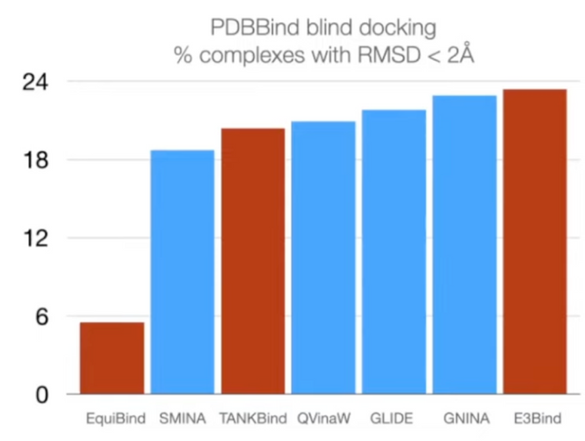

- Search based docking methods
    - Traditional methods
    - Parameterize 된 physics 기반의 **scoring function**과 **search algorithm**으로 구성
    - Scoring function
        - Input: 3D 구조
        - Output: 특정 pose에 대한 quality나 likelihood 예측
    - Search algorithm
        - Ligand pose (position, orientation, torsion angles)를 확률론적으로 랜덤하게 (stochastically) 바꿈
        - Goal: scoring function의 global optimum을 찾는 것
    - Scoring function을 parameterize하기 위해 ML이 적용되고 있지만, search space 가 너무 커서 계산량이 매우 많다.
    - 예시
        
        
        
- Regression based methods
    - 최신 딥러닝 기반의 방법들이 ground truth position에 대해 regression으로 formulation
    - Search based method 대비
        - 속도는 상당히 빨라짐.
        - 정확도에 있어서는 부족하거나, 비슷한 정도.
    - 예시
        
        
        
        - [EquiBind](https://arxiv.org/abs/2202.05146)
            
            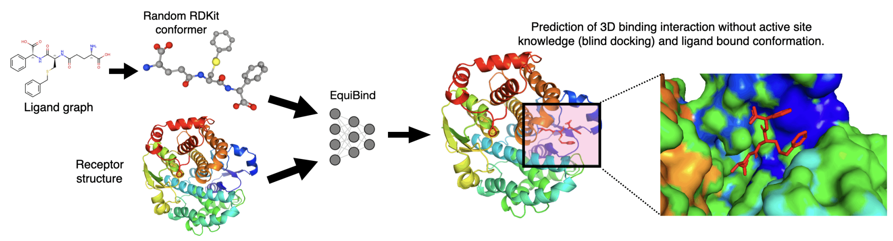
            
            - Blind docking을 regression으로 접근하여 binding pocket의 keypoint를 직접 예측함.
        - [TANKBind](https://www.biorxiv.org/content/10.1101/2022.06.06.495043v3)
            
            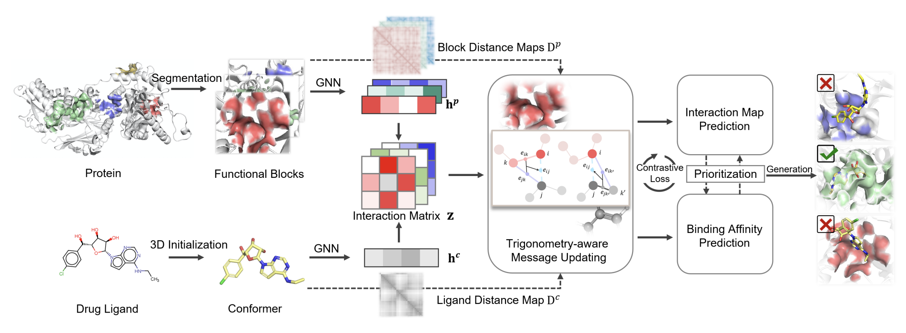
            
            - Protein의 각 가능한 pocket에 대해 docking pose를 예측하고 따로 ranking 하여 평가하여 성능 향상.
        - [E3Bind](https://arxiv.org/abs/2210.06069)
            
            
            
            - Ligand 내부의 atom끼리의 상호작용, protein residue와의 상호작용을 모두 고려하여 ligand atom embedding을 만들고, iterative하게 좌표를 업데이트하여 binding pose 예측 수행.

## Docking objective

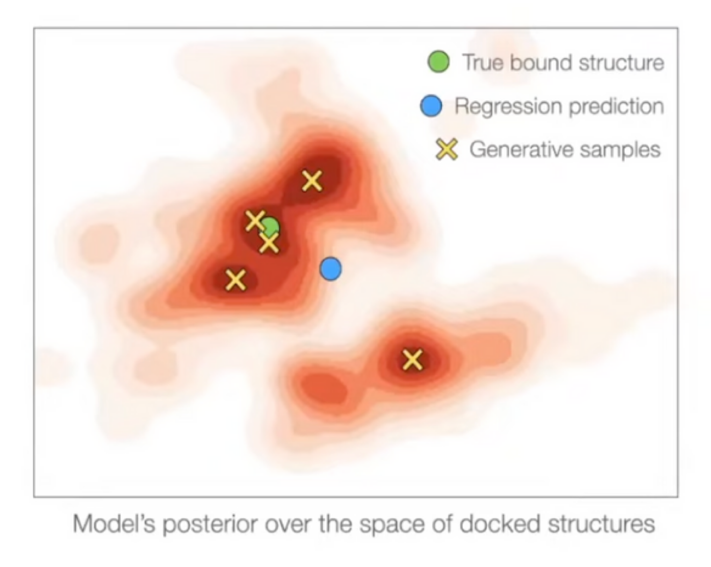

- Standard evaluation metric:
    - $\mathcal{L}\_{\epsilon} = \sum\_{x, y} I\_{\text{RMSD}(y, \hat{y}(x))<\epsilon}$: $\text{RMSD} < \epsilon$ 으로 예측한 것들의 비율 → 미분 불가능함.
    - 대신, $\text{argmin}\_{\hat{y}} \lim\_{\epsilon \rightarrow 0} \mathcal{L}\_\epsilon$ 을 objective function 으로 사용함.
- Regression은 unimodal일 경우에만 이 objective function과 일맥 상통함.
- 그러나 Docking은 상당한 aleatoric (irreducible) & epistemic (reducible) uncertainty 지님.
    - Regression 방법들은 $\sum \\|y - \hat{y}\\|^2_2$ 를 최소화하는 것이 목적이고, 이는 여러 mode들의 weighted mean을 예측하도록 학습할 것.
    - 반면 generative model은 대부분의 mode에 대해 generation 가능.

- 실제 결과를 살펴보면, EquiBind 같은 regression model은 여러 mode들의 중간에 위치하도록 예측함.
- 반면 generative model은 여러 mode들에 대해 conformer를 위치시킬 수 있음.

- DiffDock이 steric clash가 덜하다.

## DiffDock Overview

- 두 단계 model 사용
    - Score model: Translation (평행 이동), rotation (회전), torsion (비틀림)에 대해 reverse diffusion 수행
    - Confidence model: 각 ligand pose가 ground truth 와 비교 시 $\text{RMSD} < 2\text{Å}$ 차이로 잘 위치했는지 binary prediction.

### Score model

- Ligand pose: $\mathbb{R}^{3n}$ ($n$: number of atoms)
- 하지만 molecular docking은 이보다 더 적은 degree of freedom으로 수행할 수 있다.
    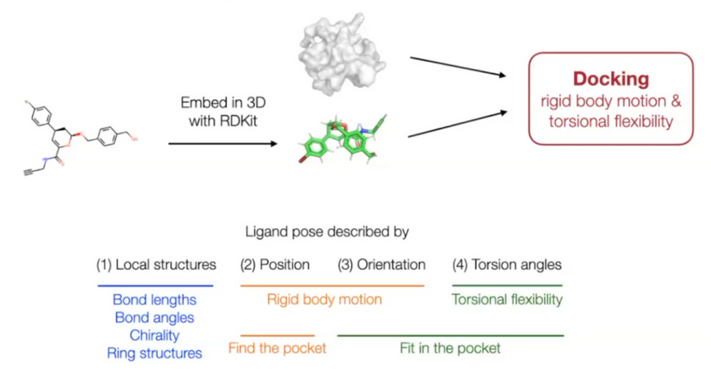

    - 축소된 degree of freedom: $(m+6)$
        - Local structure: RDKit conformer generation (`EmbedMolecule(mol)`) 이후 어느 정도 고정되어 있다고 가정할 수 있음.
            - Bond length, angle, small rings
        - Position (translation): $\mathbb{R}^3$ - 3D vector
            
            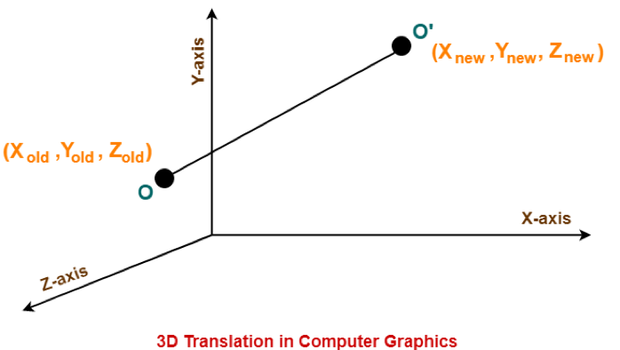
            
        - Orientation (rotation): $SO(3)$ - three Euler angle vector
            
            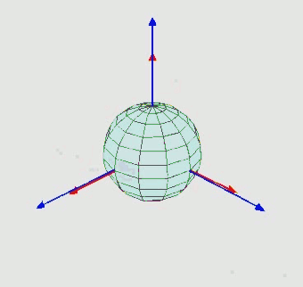
            
        - Torsion angles: $\mathbb{T}^m$ ($m$: number of rotatable bonds)
            
            
            
        - Product space $\mathbb{P}: \mathbb{R}^3 \times SO(3) \times \mathbb{T}^m$ 에서 diffusion 수행 가능
            - Seed conformation $\mathbf{c}$가 주어진 상황이라면, mapping $A(\cdot, \mathbf{c}): \mathbb{P} \rightarrow \mathcal{M}_\mathbf{c}$는 bijection 이다.
            
            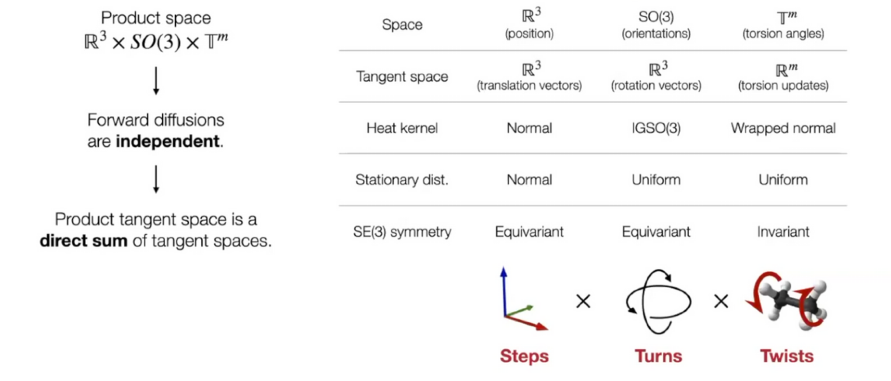
            

### Confidence Model

- Generative model은 여러 pose를 sampling 할 수 있지만, 대부분 연구자들은 1개나 몇 개 정도의 sample만 보기를 원한다.
- 따라서 confidence prediction은 downstream task에 있어 유용하게 사용될 수 있다.
- Confidence model $d(\mathbf{x}, \mathbf{y})$
    - $\mathbf{x}$: Ligand의 pose
    - $\mathbf{y}$: Target protein의 구조
- Sample들은 confidence score로 순위가 매겨지고, 가장 좋은 순위의 confidence score가 사용된다.
- Training & Inference
    - 학습된 diffusion score model에 대해 후보 pose들을 sampling 하고, binary label (각 pose가 ground truth pose 대비 $\text{RMSD} < 2\text{Å}$인지 아닌지)을 만든다.
    - 이후 confidence model은 binary label을 맞추도록 cross entropy loss로 학습된다.
    - Inference 시에는 diffusion score model이 $N$개의 pose를 생성하고, confidence model에 그 pose가 전달되어 confidence score 기반으로 순위를 매겨 사용한다.

## DiffDock Workflow

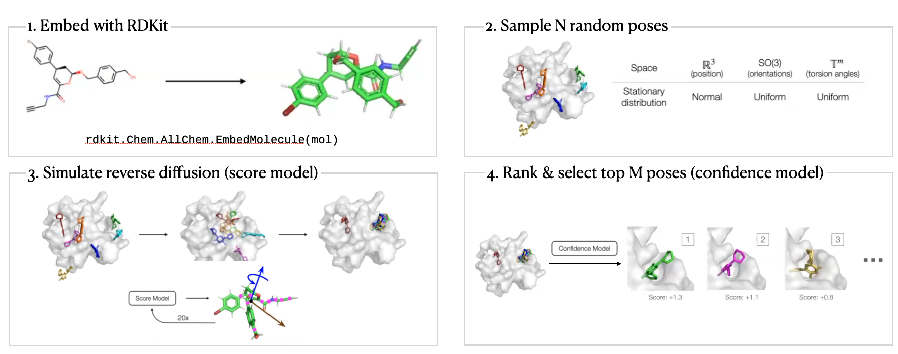

## DiffDock Results

- Standard benchmark: PDBBind
    19k experimentally determined structures of small molecules + proteins

    Baselines: search-based & deep learning
- Prediction correctness
    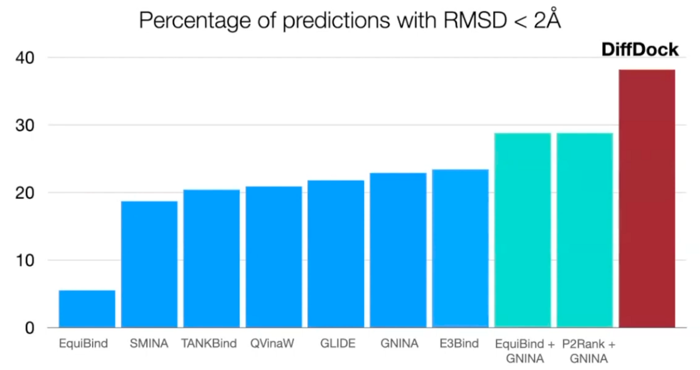
    Outperform search-based, deep learning, and pocket prediction + search-based methods
- Runtime
    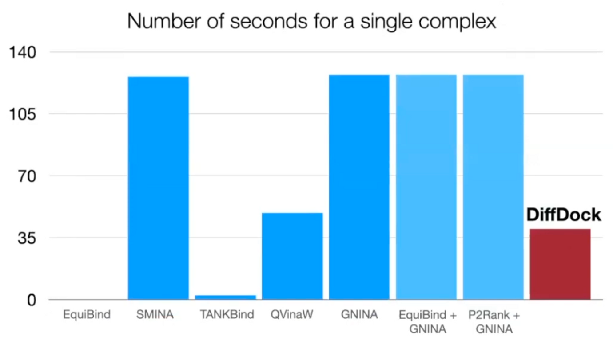
    3 times faster than the most accurate baseline
- Generalization to unseen receptors
    
    Able to generalize: outperform classical method
- Reverse diffusion process GIF
    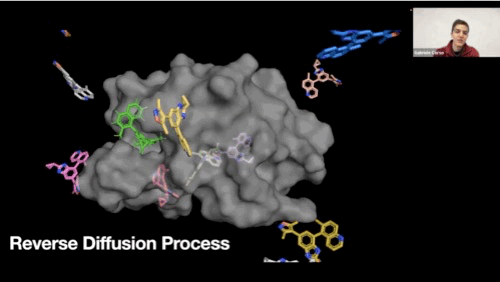
- Confidence score quality
    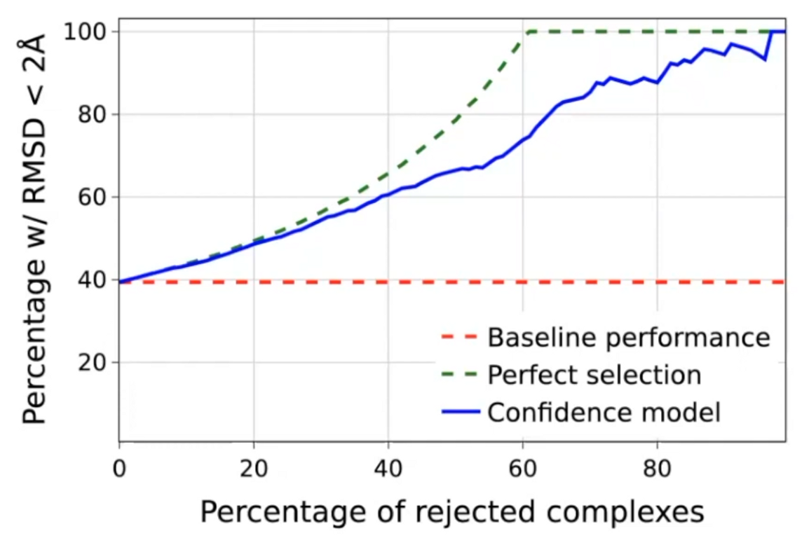
    High selective accuracy: valuable information for practitioners

## Personal opinions

- Molecular docking을 generation problem으로 formulation 했다는 점이 아주 인상 깊다.
- Conformer generation의 condition으로 protein structure를 사용했다.
- 하지만 two step approach라는 점, 그리고 confidence model의 input이 predicted ligand pose $\hat{\mathbf{x}}$와 protein structure $\mathbf{y}$ 인데, 결국 예측하는 것은 “predicted ligand pose $\hat{\mathbf{x}}$와 ground truth ligand pose $\mathbf{x}$ 간의 차이가 2Å 이하인지” 라서 약간의 괴리감이 있는 것 같다.
- 아직 성능 개선의 room 이 상당히 남아있지만, GPU workload가 꽤 많이 들어서 우리 연구실에서 수행하기에는 어려울 수도 있을 것 같다는 생각이 든다.
- Docking 이지만 physics 기반의 inductive bias가 들어가 있지는 않은 것 같아서 얼마나 generalization 하기에 적합한지 의문이다.

## Reference

- Article
    
    [DiffDock: Diffusion Steps, Twists, and Turns for Molecular Docking](https://openreview.net/forum?id=kKF8_K-mBbS)
    
- Youtube
    
    [DiffDock: Diffusion Steps, Twists, and Turns for Molecular Docking](https://youtu.be/gAmTGw601dA)
    
- Blog
    
    [Generative Modeling by Estimating Gradients of the Data Distribution | Yang Song](https://yang-song.net/blog/2021/score/)
    
    [What are Diffusion Models?](https://lilianweng.github.io/posts/2021-07-11-diffusion-models/)