ICLR, '23 
["DiffDock: Diffusion Steps, Twists, and Turns for Molecular Docking"](https://arxiv.org/abs/2210.01776)

# Summary

- Molecular docking as a generative problem, not regression!
    - Problem of learning a distribution over ligand poses conditioned on the target protein structure $p(\mathbf{x} | \mathbf{y})$
- Used “Diffusion process” for generation
- Two separate model
    - Score model: $s(\mathbf{x}, \mathbf{y}, t)$
        
        Predicts score based on ligand pose $\mathbf{x}$, protein structure $\mathbf{y}$, and timestep $t$
        
    - Confidence model: $d(\mathbf{x}, \mathbf{y})$
        
        Predicts whether the ligand pose has RMSD below 2Å compared to ground truth ligand pose
        
- Diffusion on Product space $\mathbb{P}$
    - Reduced degrees of freedom $3n \rightarrow (m+6)$

## Preliminaries

### Molecular Docking

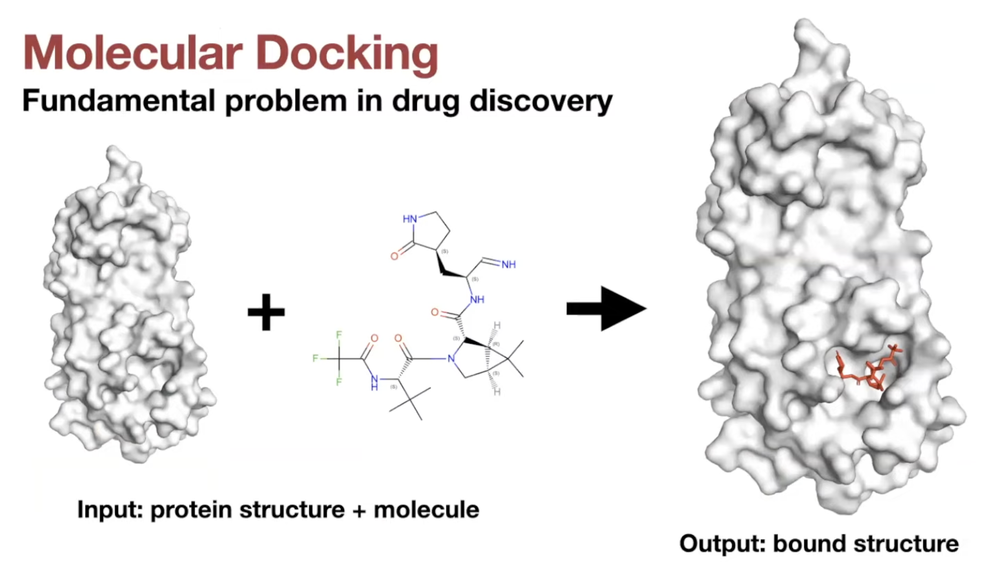

- Definition:
    
    Predicting the position, orientation, and conformation of a ligand when bound to a target protein
    
- Two types of tasks
    - Known-pocket docking
        - Given: position of the binding pocket
    - Blind docking
        - More general setting: no prior knowledge about binding pocket

### Previous works: Search-based / Regression-based

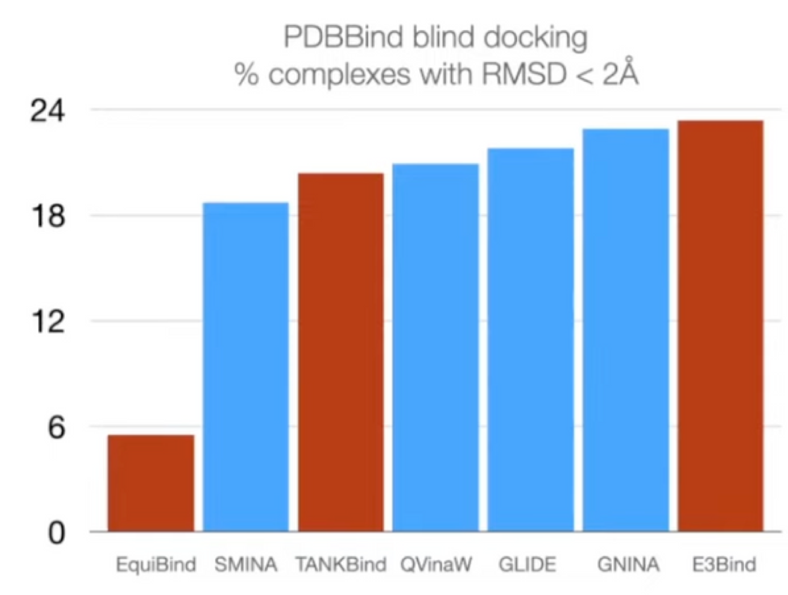

- Search based docking methods
    - Traditional methods
    - Consist of parameterized physics-based **scoring function** and a **search algorithm**
    - Scoring function
        - Input: 3D structures
        - Output: estimate of the quality/likelihood of the given pose
    - Search algorithm
        - Stochastically modifies the ligand pose (position, orientation, torsion angles)
        - Goal: finding the global optimum of the scoring function.
    - ML has been applied to parameterize the scoring function.
        - But very computationally expensive (large search space)
    - Example
        
        
        
- Regression based methods
    - Recent deep learning method
    - Significant speedup compared to search based methods
    - No improvements in accuracy
    - Example
        
        
        
        - [EquiBind](https://arxiv.org/abs/2202.05146)
            
            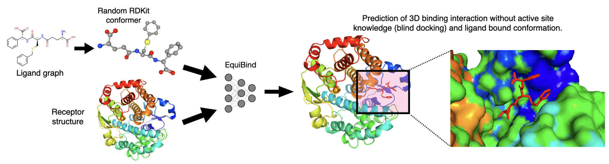
            
            - Tried to tackle the blind docking task as a **regression problem** by directly predicting pocket keypoints on both ligand and protein and aligning them.
        - [TANKBind](https://www.biorxiv.org/content/10.1101/2022.06.06.495043v3)
            
            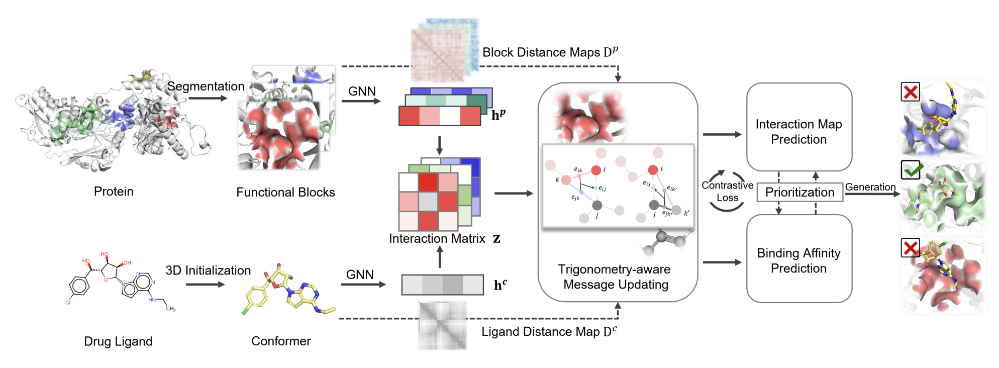
            
            - Improved over this by independently predicting a docking pose for each possible pocket and then ranking them.
        - [E3Bind](https://arxiv.org/abs/2210.06069)
            
            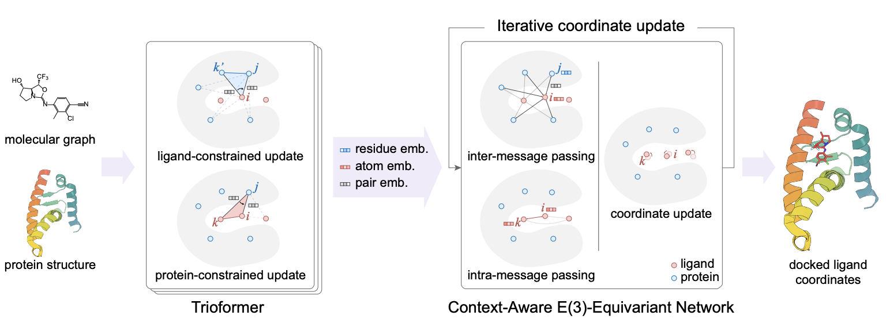
            
            - Used ligand-constrained & protein-constrained update layer to embed ligand atoms and iteratively updated coordinates.

## Docking objective

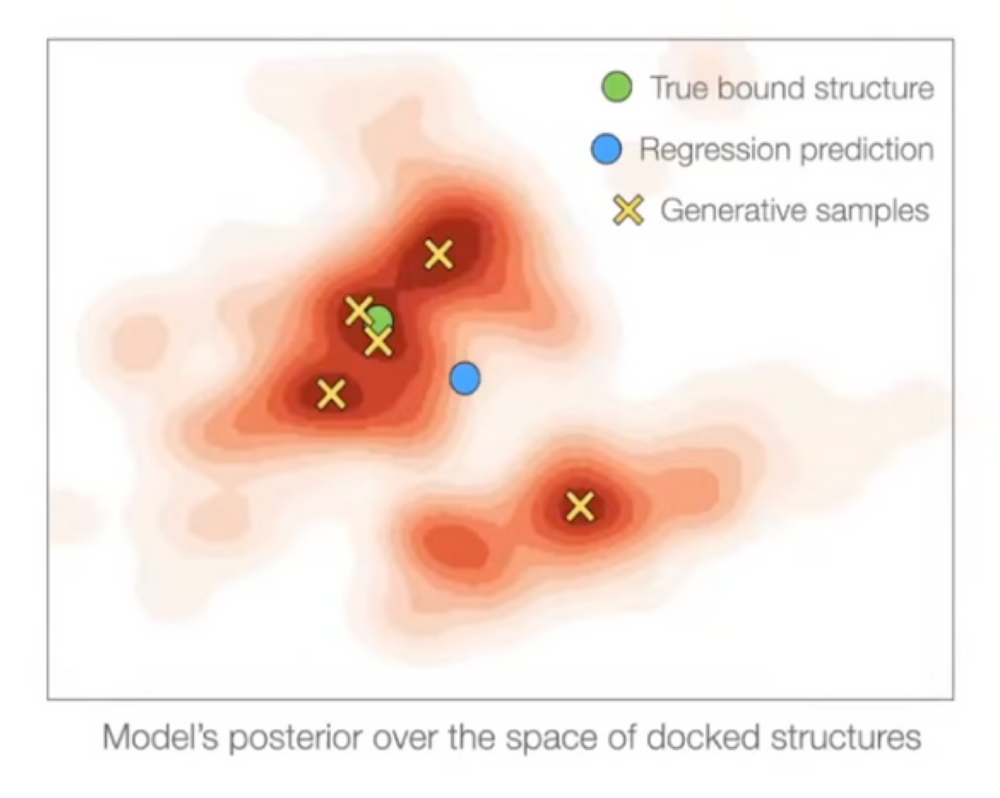

- Standard evaluation metric:
    - $\mathcal{L}\_{\epsilon} = \sum\_{x, y} I\_{\text{RMSD}(y, \hat{y}(x))<\epsilon}$:
    
        proportion of predictions with $\text{RMSD} < \epsilon$ → Not differentiable!
    - Instead, we use $\text{argmin}\_{\hat{y}} \lim\_{\epsilon \rightarrow 0} \mathcal{L}\_\epsilon$ as objective function.
- Regression is suitable for docking only if it is unimodal.
- Docking has significant aleatoric (irreducible) & epistemic (reducible) uncertainty
    - Regression methods will minimize $\sum \\|y - \hat{y}\\|^2_2$ → will produce weighted mean of multiple modes
    - On the other hand, generative model will populate all/most modes!

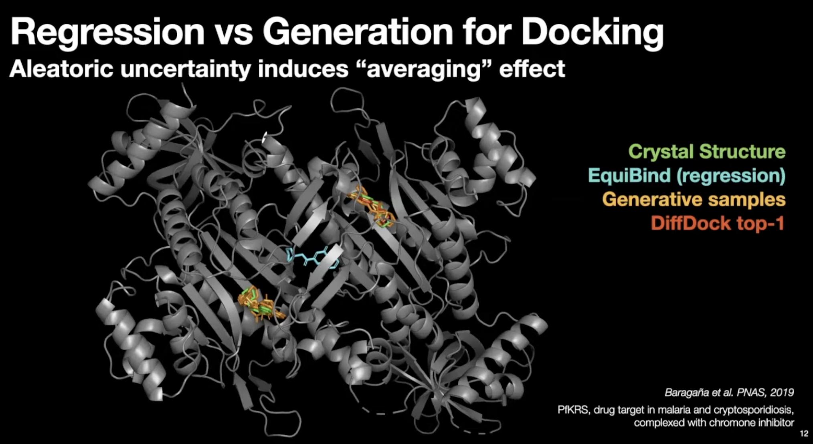

- Regression (EquiBind) model set conformer in the middle of the modes.
- Generative samples can populate conformer in most modes.

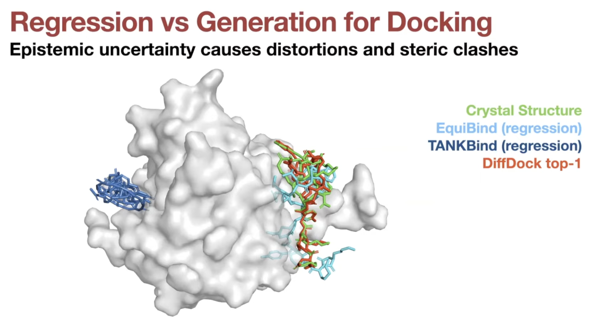

- Much less steric clashes for generative models

## DiffDock Overview

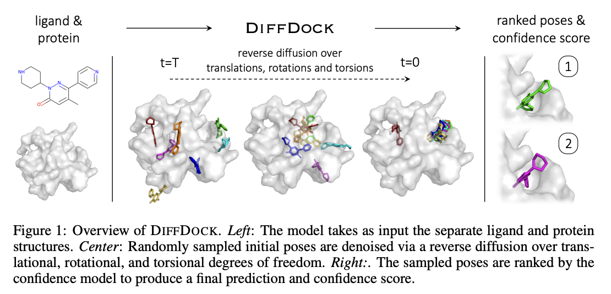

- Two-step approach
    - Score model: Reverse diffusion over translation, rotation, and torsion
    - Confidence model: Predict whether or not each ligand pose is $\text{RMSD} < 2\text{Å}$ compared to ground truth ligand pose

### Score model

- Ligand pose: $\mathbb{R}^{3n}$ ($n$: number of atoms)
- But molecular docking needs far less degrees of freedom.
    
    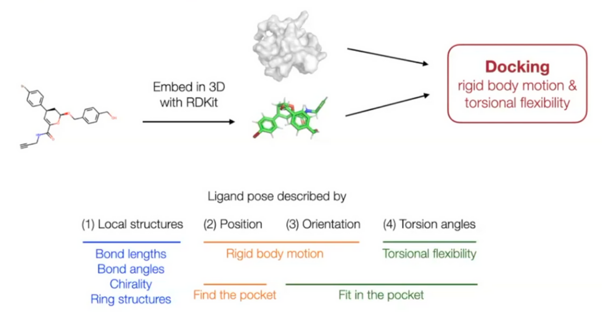
    
    - Reduced degree of freedom: $(m+6)$
        - Local structure: Fixed (rigid) after conformer generation with RDKit `EmbedMolecule(mol)`
            - Bond length, angles, small rings
        - Position (translation): $\mathbb{R}^3$ - 3D vector
            
            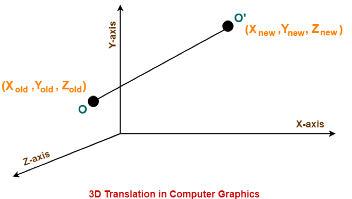
            
        - Orientation (rotation): $SO(3)$ - three Euler angle vector
            
            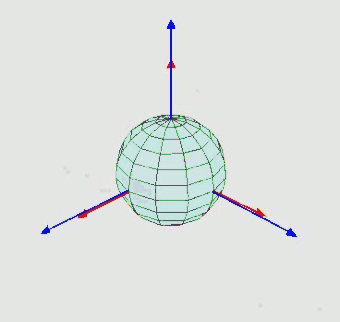
            
        - Torsion angles: $\mathbb{T}^m$ ($m$: number of rotatable bonds)
            
            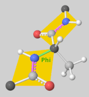
            
    - Can perform diffusion on product space $\mathbb{P}: \mathbb{R}^3 \times SO(3) \times \mathbb{T}^m$
        - For a given seed conformation $\mathbf{c}$, the map $A(\cdot, \mathbf{c}): \mathbb{P} \rightarrow \mathcal{M}_\mathbf{c}$ is a bijection!
        
        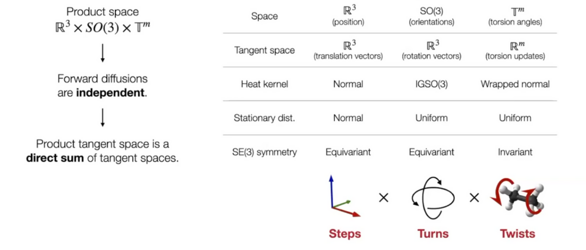
        

### Confidence Model

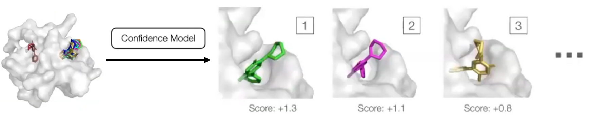

- Generative model can sample an arbitrary number of poses, but researchers are interested in one or a fixed number of them.
- Confidence predictions are very useful for downstream tasks.
- Confidence model $d(\mathbf{x}, \mathbf{y})$
    - $\mathbf{x}$: pose of a ligand
    - $\mathbf{y}$: target protein structure
- Samples are ranked by score and the score of the best is used as overall confidence score.
- Training & Inference
    - Ran the trained diffusion model to obtain a set of candidate poses for every training example and generate binary labels: each pose has RMSD below $2 \text{Å}$ or not.
    - Then the confidence model is trained with cross entropy loss to predict the binary label for each pose.
    - During inference, diffusion model is run to generate $N$ poses in parallel, and passed to the confidence model that ranks them based on its confidence that they have RMSD below $2\text{Å}$.

## DiffDock Workflow

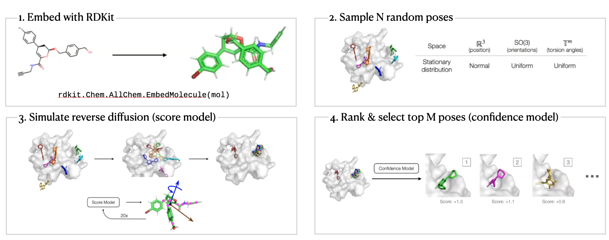

## DiffDock Results

- Standard benchmark: PDBBind
    
    19k experimentally determined structures of small molecules + proteins
    
    Baselines: search-based & deep learning
    
- Prediction correctness
    
    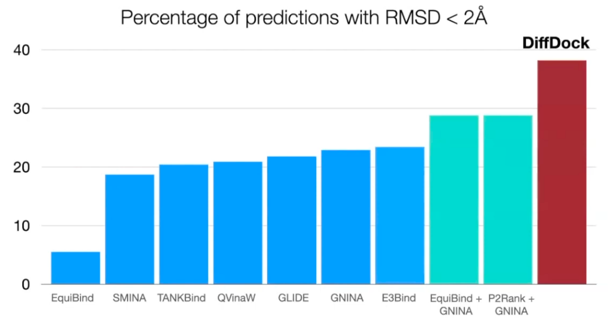
    
    Outperform search-based, deep learning, and pocket prediction + search-based methods
    
- Runtime
    
    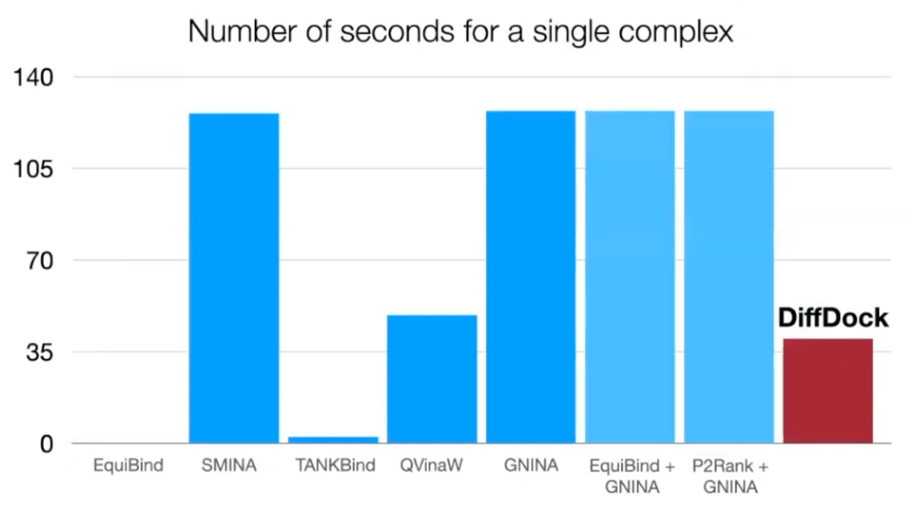
    
    3 times faster than the most accurate baseline
    
- Generalization to unseen receptors
    
    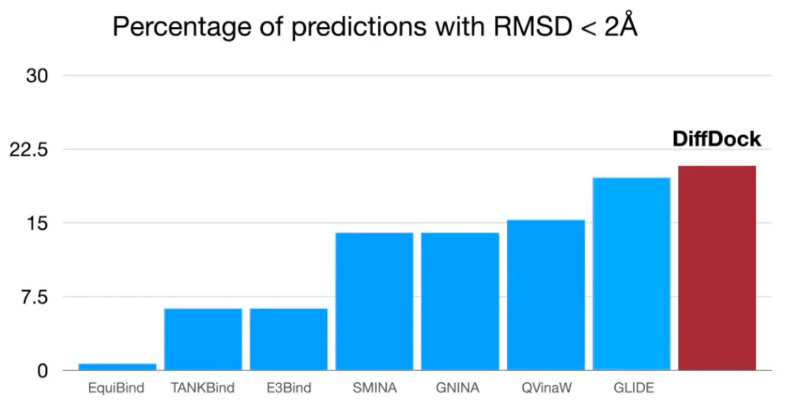
    
    Able to generalize: outperform classical method
    
- Reverse diffusion process GIF
    
    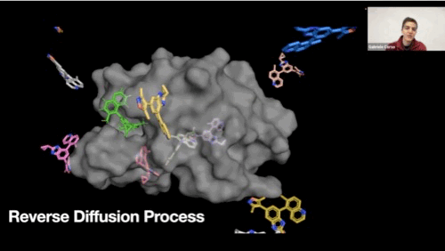
    
- Confidence score quality
    
    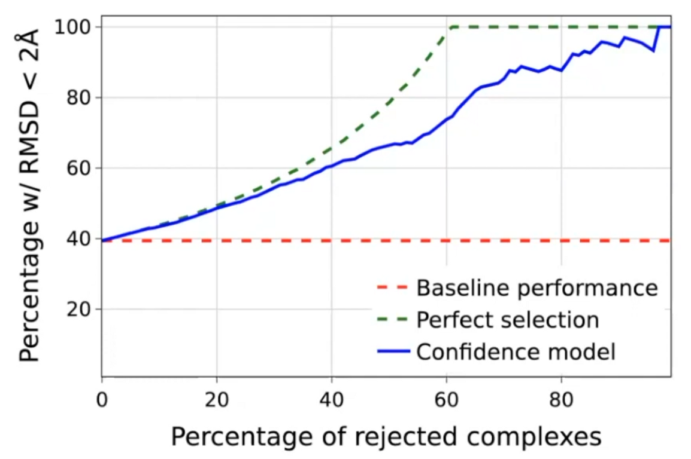
    
    High selective accuracy: valuable information for practitioners
    

## Personal opinions

- It is impressive that the authors formulated molecular docking as a generative problem, conditioned on protein structure.
- But it is not an end-to-end approach. And there are some discrepancy between the inputs and output of the confidence model. The input is the predicted ligand pose $\hat{\mathbf{x}}$ and protein structure $\mathbf{y}$, but the output is “whether the RMSE is below 2Å between predicted ligand pose $\hat{\mathbf{x}}$ and ground truth ligand pose $\mathbf{x}$”.
- There are quite a room to improve the performance, but it requires heavy workloads of GPUs.
- I’m skeptical about the generalizability of this model since there are almost no physics informed inductive bias in the model.

## Reference

- Article
    
    [DiffDock: Diffusion Steps, Twists, and Turns for Molecular Docking](https://openreview.net/forum?id=kKF8_K-mBbS)
    
- Youtube
    
    [DiffDock: Diffusion Steps, Twists, and Turns for Molecular Docking](https://youtu.be/gAmTGw601dA)
    
- Blog
    
    [Generative Modeling by Estimating Gradients of the Data Distribution | Yang Song](https://yang-song.net/blog/2021/score/)
    
    [What are Diffusion Models?](https://lilianweng.github.io/posts/2021-07-11-diffusion-models/)