ICLR, '17,  
[Few-Shot Learning with Graph Neural Networks](https://arxiv.org/abs/1711.04043)
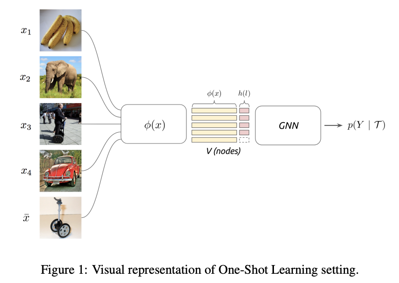

# Summary
- Used similarity value between samples for few shot learning.
- Regard each sample as nodes, and similarity kernel as edges.
- Similarity kernel is trainable. (i.e. Not just simple inner product)
- Can be applied to semi-supervised learning and active learning.
- State-of-the-art performance in Omniglot and Mini-ImageNet in 2017.

## Keywords

- Few shot learning
- Graph neural network
- Semi-supervised learning
- Active learning with Attention

## Introduction

- Supervised end-to-end learning has been extremely successful in computer vision, speech, or machine translation tasks.
- However, there are some tasks(e.g. few shot learning) that cannot achieve high performance with conventional methods.
- **New** supervised learning setup
    - Input-output setup:
        - With i.i.d. samples  of collections of images and their associated label similarity
        - cf) conventional setup: i.i.d. samples of images and their associated labels
- Authors' model can be extended to semi-supervised and active learning
    - Semi-supervised learning:
        
        Learning from a mixture of labeled and unlabeled examples
        
        ](imgs/Untitled2.png)
        
    - Active learning:
        
        The learner has the option to request those missing labels that will be most helpful for the prediction task
        
        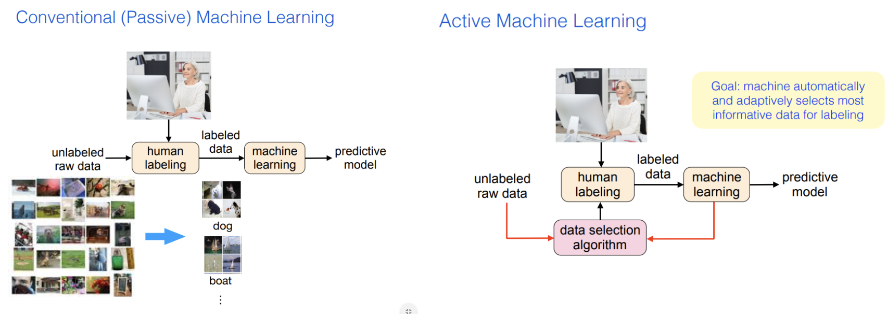
        
        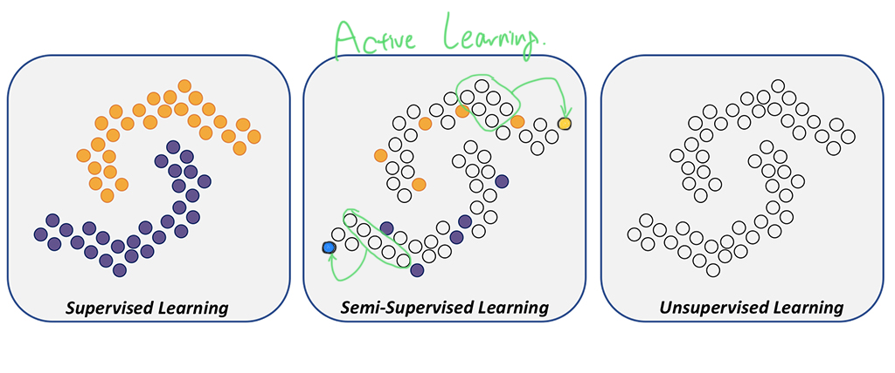

## Closely related works and ideas

- [Research article] Matching Networks for One shot learning - Vinyals et al.(2016)
    - Mapped support set of images into the desired label.
    - And developed an end-to-end trainable k-nearest neighbors, accepting those support sets as input via attention LSTM.
        
        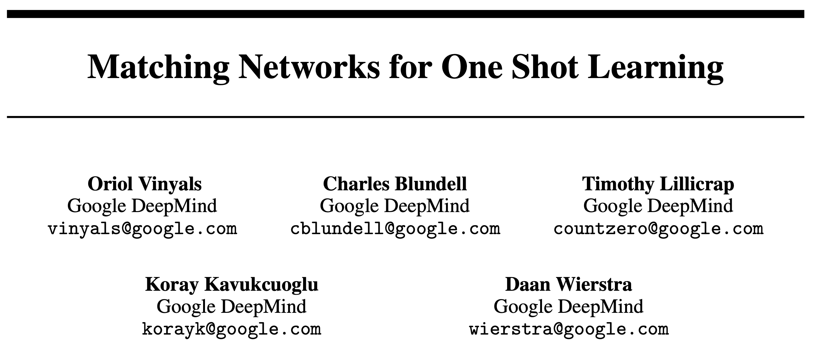  
        
        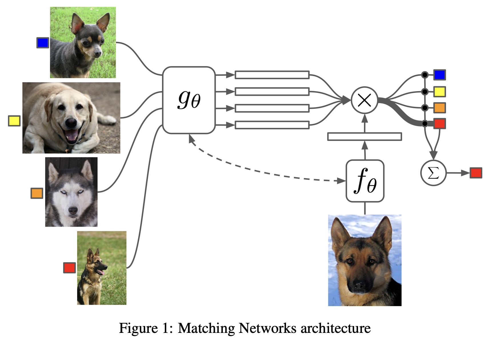
        
        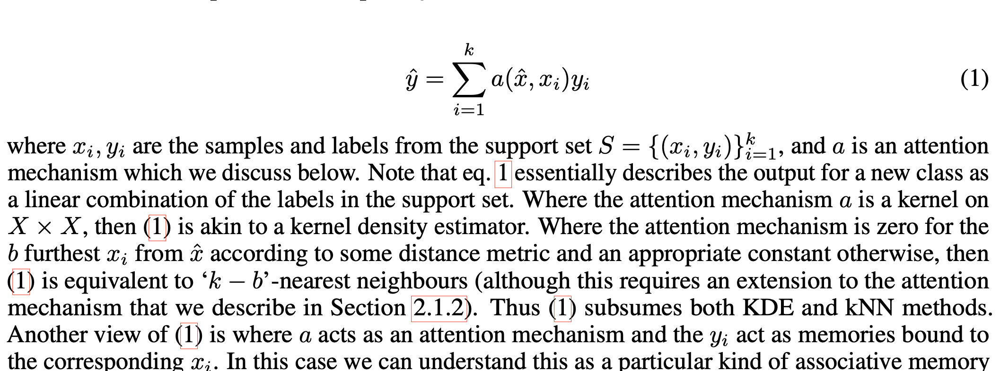
        
        - $k$: number of data in support set
        - $\hat{x}$: new data
        - $\hat{y}$: its class
        - $\hat{y}$ is a linear combination of the labels in the support set
        - $a$: attention mechanism, which is a kernel
- [Research article] Prototypical Networks for Few-shot Learning - Snell et al.(2017)
    
    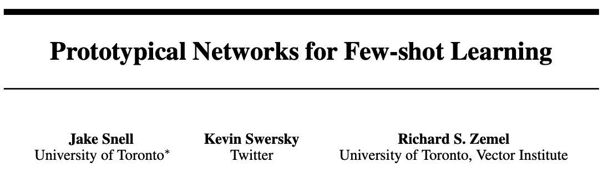
    
    
    
    Authors point out the overfitting problem of Matching networks.
    
    - Prototype: Center(mean) of each class cluster
    - Similarity: $-\text{Euclidean distance}$
- [Review article] Geometric deep learning - Bronstein et al.(2017)
    
    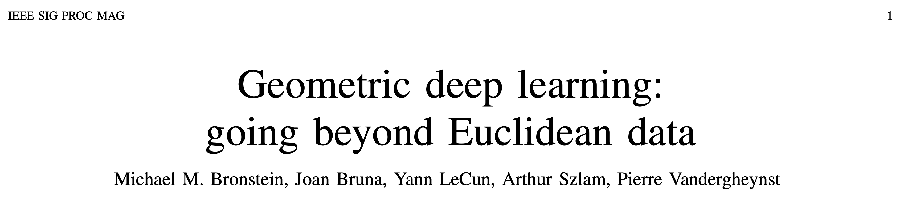
    
    > "Geometric deep learning is an umbrella term for emerging techniques attempting to generalize deep models to non-Euclidian domains such as graphs and manifolds"
    > 
- [Research article] Message passing - Gilmer et al.(2017)
    
    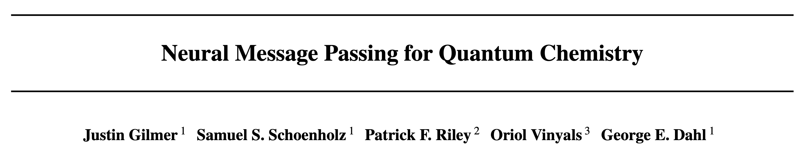
    
    $$
    m^{t+1}_v = \sum\_{w \in N(v)} M_t(h^t_v, h^t_w, e\_{vw}) \\ h^{t+1}_v = U_t(h^t_v, m^{t+1}_v )
    $$
    
    - $M_t$: message functions
    - $U_t$: vertex update functions
    - $h^t_v$: hidden states of node $v$ in the graph at time $t$
    - $m^{t+1}_v$: messages of node $v$ in the graph at time $t+1$
    - $N(v)$: neighbors of node $v$
    
    e.g.)
    
    ](https://miro.medium.com/max/1400/1*oSQyFjtUkI7_u7lJXWU68Q.gif)
    
## Problem set-up

Authors view the task as a supervised interpolation problem on a graph

- Nodes: **Images**
- Edges: **Similarity kernels →** *TRAINABLE*

### General set-up

Input-output pairs $(\mathcal{T}_i, Y_i)_i$ drawn from i.i.d. from a distribution $\mathcal{P}$ of partially labeled image collections

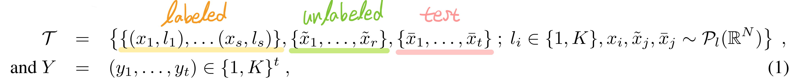

- $s$: # labeled samples
- $r$: # unlabled samples
- $t$: # samples to classify
- $K$: # classes
- $\mathcal{P}_l(\mathbb{R}^N)$: class-specific image distribution over $\mathbb{R}^N$
- targets $Y_i$ are associated with $\bar{x}_1, ..., \bar{x}_t \in \mathcal{T}_i$

Learning objective:

$\min_\Theta \frac{1}{L} \sum_{i \leq L} \ell(\Phi(\mathcal{T}_i, \Theta), Y_i) + \mathcal{R}(\Theta)$

($\mathcal{R}$ is the standard regularization objective)

### Few shot learning setting

$r=0, t=1, s=qK$   $\longrightarrow$   $q-\text{shot} \, K-\text{way}$

### Semi-supervised learning setting

$r > 0, t=1$

Model can use the auxiliary images(unlabeled set) $\{ \tilde{x}_1, ..., \tilde{x}_r \}$ to improve the prediction accuracy, by leveraging the fact that these samples are drawn from the common distributions.

### Active learning setting

The learner has the ability to request labels from the auxiliary images $\{\tilde{x}_1, ..., \tilde{x}_r\}$.

## Model

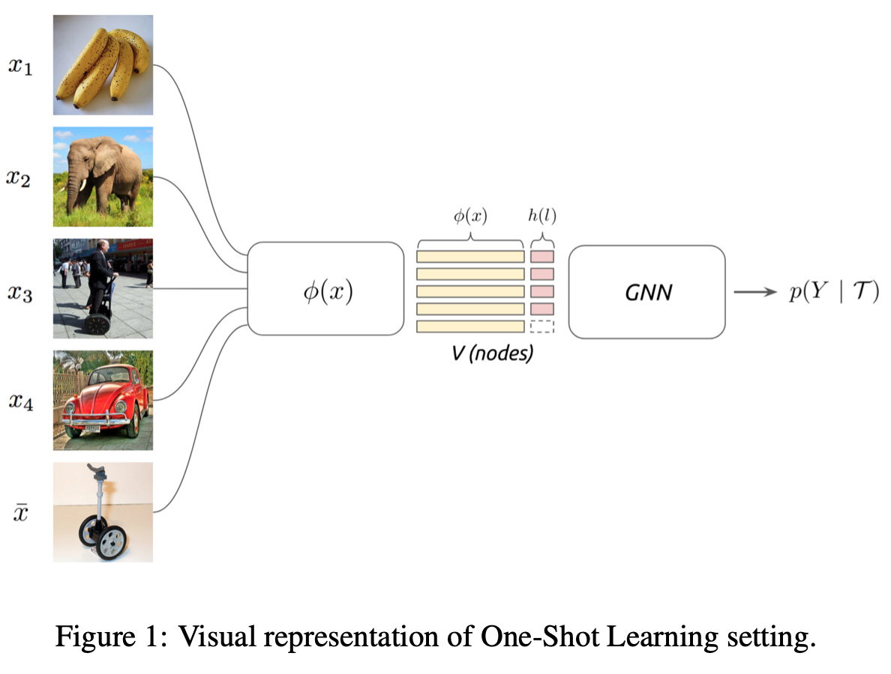

- $\phi(x)$: CNN
- $h(l)$: One-hot encoded label(for labeled set), or uniform distribution(for unlabeled set)

### Set and Graph Input Representations

The goal of few shot learning:

To propagate label information from labeled samples towards the unlabeled query image

→ The propagation can be formalized as a posterior inference over a graphical model

$G_\mathcal{T} = (V,E)$

Similarity measure is not pre-specified, but learned!

c.f.) in Siamese network, the similarity measure is fixed(L1 distance)!

본 논문(Few shot learning with GNN)에 쓰인 문장 구조가 이상해서 헷갈리게 쓰여있음.

](imgs/Untitled13.png)

### Graph Neural Networks

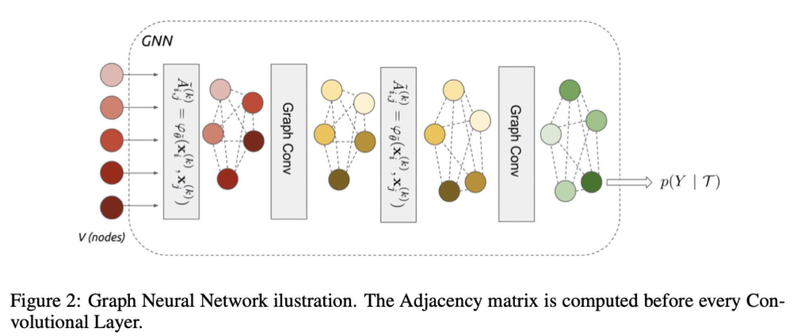

We are given an input signal $F \in \mathbb{R}^{V \times d}$ on the vertices of a weighted graph $G$.

Then we consider a family, or a set "$\mathcal{A}$" of graph intrinsic linear operators.

$\mathcal{A} = \{\tilde{A}^{(k)}, \mathbf{1}\}$

- Linear operator
    
    e.g.) Simplest linear operator is adjacency operator $A$, where $(AF)_i = \sum_{j \sim i} w_{i,j}F_j$ ($w_{i,j}$ is associated weight)
    

GNN layer

A GNN layer $\text{Gc}(\cdot)$ receives as input a signal $\mathbf{x}^{(k)} \in \mathbb{R}^{V\times d_k}$ and produces $\mathbf{x}^{(k+1)} \in \mathbb{R}^{V\times d_{k+1}}$

$$
\mathbf{x}^{(k+1)} = \text{Gc}(\mathbf{x}^{(k)}) = \rho\Big(\sum_{B\in\mathcal{A}} B\mathbf{x}^{(k)}\theta^{(k)}_{B, l}\Big )
$$

$\mathbf{x}^{(k)}$: representation vector of a certain node at time step $k$

$\theta$: trainable parameters

$\rho$: Leaky ReLU

Construction of edge feature matrix, inspired by message passing algorithm

$$
\tilde{A}^{(k)}\_{i, j} = \varphi\_{\tilde{\theta}}(\mathbf{x}^{(k)}_i, \mathbf{x}^{(k)}_j )
$$

- $\tilde{A}^{(k)}\_{i, j}$: **learned** edge features from the node's current hidden representation(at time step $k$)
- $\varphi$: a metric and a symmetric function parameterized with neural network
    
    $$
    \varphi\_{\tilde{\theta}}(\mathbf{x}^{(k)}_i, \mathbf{x}^{(k)}_j ) = \text{MLP}\_{\tilde{\theta}}(abs(\mathbf{x}^{(k)}_i - \mathbf{x}^{(k)}_j))
    $$
    

→ $\tilde{A}^{(k)}$ is then normalized by row-wise softmax

→ And added to the family $\mathcal{A} = \{\tilde{A}^{(k)}, \mathbf{1}\}$

- $\mathbf{1}$: Identity matrix, which is the self-edge to aggregate vertex's own features

Construction of initial node features

$$
\mathbf{x}^{(0)}_i = (\phi(x_i), h(l_i))
$$

$\phi$: convolutional neural network

$h(l) \in \mathbb{R}^K_+$ : a one-hot encoding of the label

For images with unknown label, $\tilde{x}_j$(unlabeled data) and  $\bar{x}_j$(test data), $h(l_j)$ is set with uniform distribution.

## Training

### Few-shot and Semi-supervised learning

The final layer of GNN is a softmax mapping. We then use cross-entropy loss:

$$
\ell(\Phi(\mathcal{T}; \Theta), Y) = -\sum_k y_k \log P(Y_* = y_k \, |\, \mathcal{T})
$$

The semi-supervised setting is trained identically, but the initial label fields of $\tilde{x}_j$s will be filled with uniform distribution.

### Active learning (with attention)

In active learning, the model has the intrinsic ability to query for one of the labels from $\{ \tilde{x}_1, ..., \tilde{x}_r \}$.

The network will learn to ask for the most informative label to classify the sample $\bar{x}$.

The querying is done after the first layer of GNN by using a softmax attention over the unlabeled nodes of the graph.

Attention

We apply a function $g(\mathbf{x}^{(1)}_i) \in \mathbb{R}^1$ that maps each unlabeld vector node to a scalar value.

A softmax is applied over the $\{1, ..., r\}$ scalar values obtained after applying $g$:

$r$: # unlabeled samples

$$
\text{Attention} = \text{Softmax}(g(\mathbf{x}^{(1)}\_{\{1,...,r\}}))
$$

To query only one sample we set all elements to zero except for one. → $\text{Attention}'$

- At training, model randomly samples one value based on its multinomial probability.
- At test, model just keeps the maximum value.

Then we multiply this with the label vectors

$$
w \cdot h(l_{i*}) = \langle \text{Attention}', h(l_{\{1, ..., r\}}) \rangle
$$

($w$ is scaling factor)

This value is then summed to the current representation.

$$
\mathbf{x}^{(1)}\_{i*} = [\text{Gc}(\mathbf{x}^{(0)}\_{i*}), \mathbf{x}^{(0)}\_{i*}] = [\text{Gc}(\mathbf{x}^{(0)}\_{i*}), (\phi(x\_{i*}), h(l\_{i*}))]
$$

## Results

### Few-shot learning

Omniglot

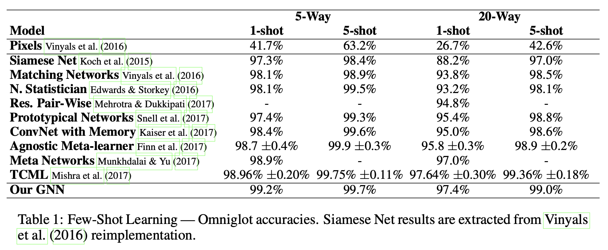

\# of parameters: $\sim5\text{M} (\text{TCML})$, $\sim300 \text{K}(3 \text{layers GNN})$

Omniglot: 1,623 characters  X 20 examples for each characters

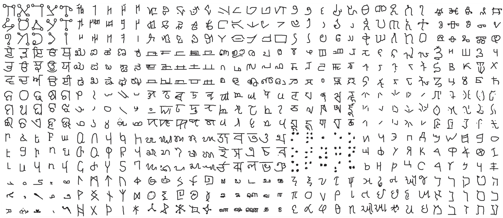

Mini-ImageNet: Originally introduced by Vinyals et al.(2016)

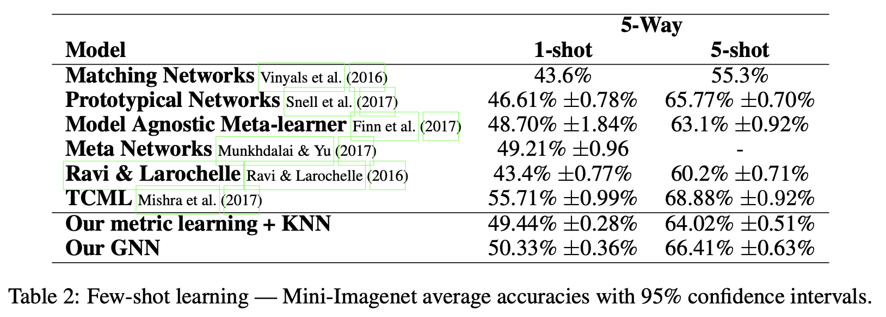

\# of parameters: $\sim 11\text{M} (\text{TCML})$, $\sim 400 \text{K}(3 \text{ layers GNN})$

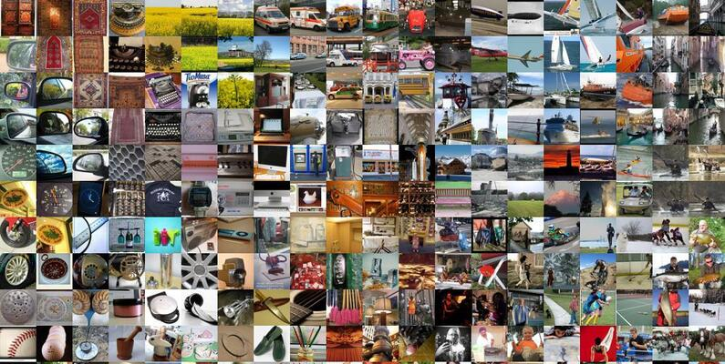

Mini-ImageNet

Divided into 64 training, 16 validation, 20 testing classes each containing 600 examples.

### Semi-supervised learning

Omniglot

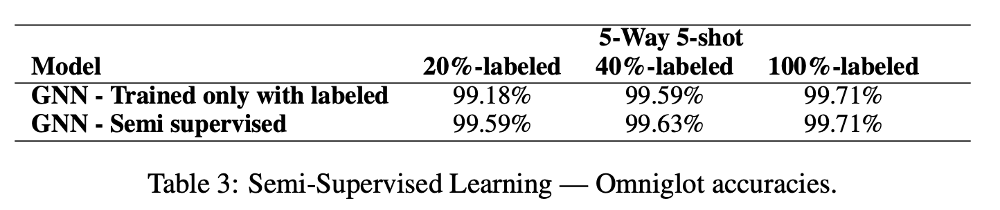

Mini-ImageNet

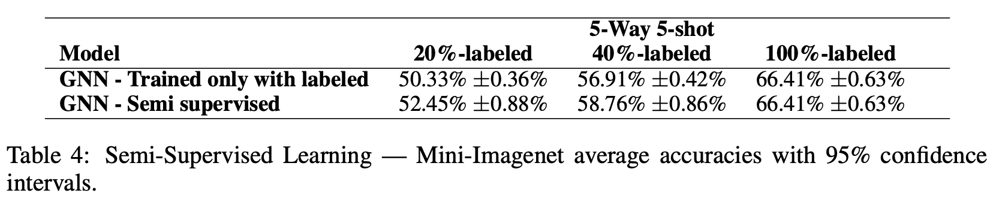

### Active learning

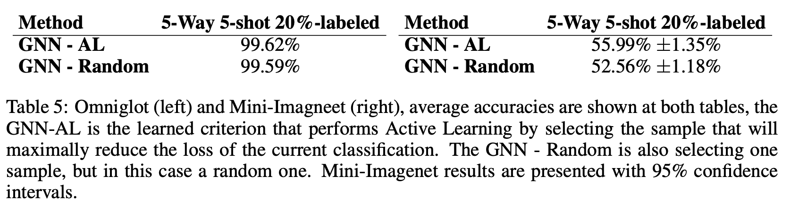

Random: Network chooses a random sample to be labeled, instead of one that maximally reduces the loss of the classification task $\mathcal{T}$

## References