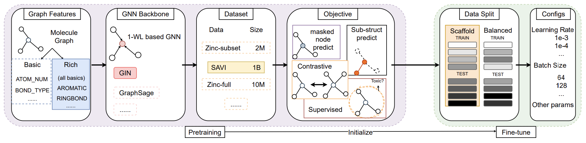

NeurIPS, '22  
[Does GNN Pre-training Help Molecular Representation?](https://arxiv.org/abs/2207.06010)

# Summary
- Self-supervised pre-training alone **does not** provide statistically significant improvements over non-pre-trained methods on downstream tasks.
- **Data splits, hand-crafted rich features, or hyperparameters** can bring significant improvements.

## Preliminaries

Pre-train objectives

- Self-supervised
    - Node prediction
    - Context prediction
    - Motif prediction
    - Contrastive learning
- Supervised
    - Related tasks with label (e.g. ChEMBL dataset)

Graph features

- Basic
    Feature set used in [Hu et al.](https://arxiv.org/abs/1905.12265)  
    

- Rich
    
    Feature set used in [Rong et al.](https://arxiv.org/abs/2007.02835) This is the superset of basic features.
    
    In downstream tasks, additional 2d normalized `rdNormalizedDescriptors` are used (not in pre-training).

Downstream splits

- Scaffold
    
    Sorts the molecule according to the scaffold, then partition the sorted list into train/valid/test splits. → Deterministic
    
    Molecules of each set are most different ones.
    
- Balanced scaffold
    
    Introduces the randomness in the sorting and splitting stages of Scaffold split.

GNN architecture

- GIN
- GraphSAGE

Pre-train dataset

- ZINC15 (self-supervised)
    
    2 million molecules. Pre-processed following Hu et al.
    
- SAVI (self-supervised)
    
    1 billion drug-like molecules synthesized by computer simulated reactions.
    
- ChEMBL (supervised)
    
    500k drugable molecules with 1,310 prediction target labels from bio-activity assays.

## Results
  

  

  

  

  

  

  

  

  

  

## Key Takeaways
### When pre-training might help?
1. Related **supervised** pre-training dataset. But not always feasible.
2. If the rich features are absent.
3. If the downstream split distributions are substantially different.
### When the gain dimishes?
1. If using rich features.
2. If don’t have the highly relevant supervisions.
3. If the downstream split is balanced.
4. If the self-supervised learning dataset lacks diversity.
### Why pre-training may not help in some cases?
Some of the pre-training methods (e.g. node label prediction) might be too easy  
→ Transfer less knowledge.

So…  
1. Use rich features
2. Use balanced scaffold
3. Use related supervised pre-training dataset
4. Use difficult pre-training task (for self-supervised pre-training) and use high-quality negative samples.