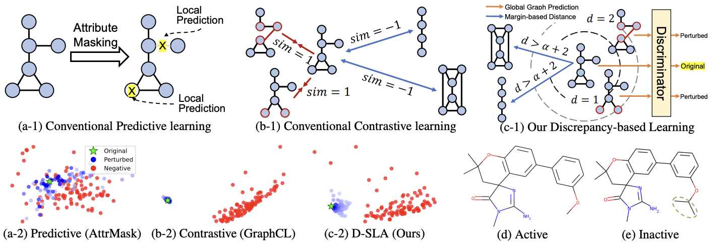
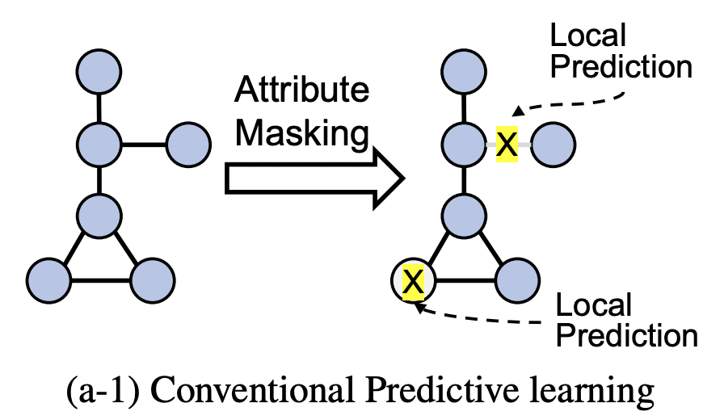
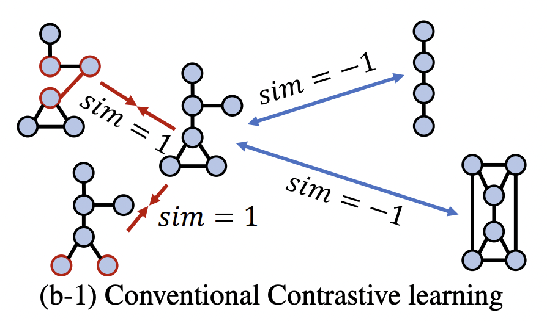
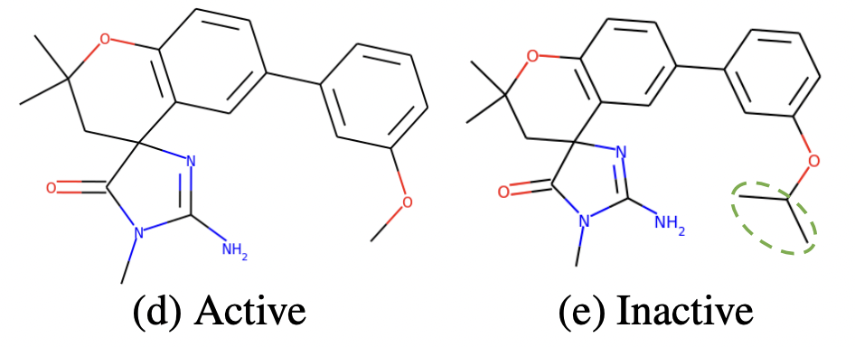
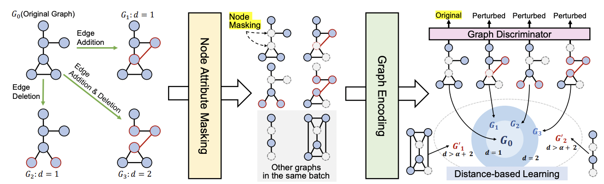
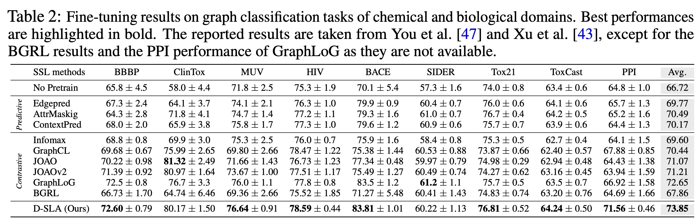
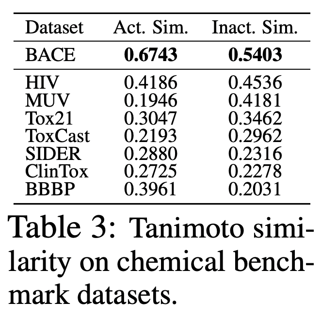
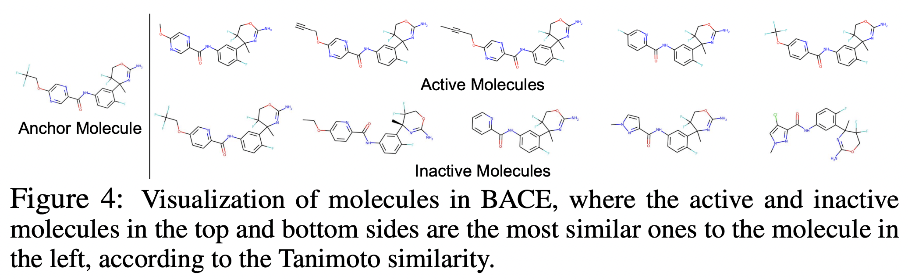

NeurIPS, '22,  
[Graph Self-supervised Learning with Accurate Discrepancy Learning](https://openreview.net/forum?id=SgZ-glWWUlq)

# Summary
- Authors proposed a framework called D-SLA that aims to learn the exact discrepancy between the original and the perturbed graphs.
- Three major components
    1. Learn to distinguish whether each graph is the original graph or the perturbed one.
    2. Capture the amount of discrepancy for each perturbed graph (using edit distance)
    3. Learn relative discrepancy with other graphs

## Preliminaries

### Graph Neural Networks (GNN)

1. Aggregate the features from its neighbors
2. Combining the aggregated message

**Variants of Update & Aggregate functions**

- Graph Convolution Network (GCN)
    
    General convolution operation + Mean aggregation
    
- GraphSAGE
    
    Concatenate representations of neighbors with its own representation when updating
    
- Graph Attention Network (GAT)
    
    Considers the relative importance among neighboring nodes when aggregation
    
- Graph Isomorphism Network (GIN)
    
    Sum aggregation
    

### Self-supervised learning for graphs (GSL)

Aims to learn a good representation of the graphs in an unsupervised manner.

→ Transfer this knowledge to downstream tasks.

Most prevalent framework for GSL

- Predictive learning (PL)
    
    Aims to learn **contextual relationships** by predicting sub-graphical features (nodes, edges, subgraphs)
    
    - predict the attributes of masked nodes
    - predict the presence of an edge or a path
    - predict the generative sequence, contextual property, and motifs
    
    But predictive learning **may not capture the global structures and/or semantics of graphs.**
    
    
    
- Contrastive learning (CL)
    
    Aims to **capture global level information.**
    
    - Early CL learn the similarity between the entire graph and its substructure.
    - Others include attribute masking, edge perturbation, and subgraph sampling.
    - Recent CL adversarial methods generate positive examples either by adaptively removing the edges or by adjusting the attributes.
    
    But CL **may not distinguish two topologically similar graphs yet having completely different properties.**
    
    
    
    
    
    Minimize $\mathcal{L}\_{CL} = - \log \frac{f\_{\text{sim}} (h\_{\mathcal{G}_i}, h\_{\mathcal{G}_j})}{\sum\_{\mathcal{G}', \mathcal{G' \neq \mathcal{G}_0}}f\_{\text{sim}}(h\_{\mathcal{G}_i}, h\_{\mathcal{G}'})}$
    
    - $\mathcal{G}_0$: original graph
    - $\mathcal{G}_i, \mathcal{G}_j$: perturbed graphs
    - $\mathcal{G}'$: other graph in the same batch with the $\mathcal{G}_0$, a.k.a. negative graph
    - positive pair: $(\mathcal{G}_i, \mathcal{G}_j)$; negative pair: $(\mathcal{G}_i, \mathcal{G}')$
    - $f_\text{sim}$: similarity function between two graphs → $L_2$ distance or cosine similarity
    
    → similarity of positive pair $\uparrow$, similarity of negative pair $\downarrow$
    

## Discrepancy Learning

1. Discriminate original vs perturbed
    
    **Perturbed graph could be semantically incorrect!**
    
    → Embed perturbed graph apart from original.
    
    $\mathcal{L}\_{GD} = - \log \Big (\frac{e^{S_0}}{e^{S_0} + \sum\_{i \geq 1}e^{S_i}} \Big ) \text{ with } S = f_S(h\_{\mathcal{G}})$
    
    Intuitively,
    
    - large value of $e^{S_0}$ for the original graph
    - small value of $e^{S_i}$ for the perturbed graphs
    
    How to perturb?
    
    Aim at perturbed graph to be semantically incorrect
    
    1. Remove or add a small number of edges
        
        Manipulate the edge set by removing existing edges  + adding new edges on $\mathcal{X}_\mathcal{E}$
        
    2. Mask node attributes
        
        Randomly mask the node attributes on $\mathcal{X}_\mathcal{V}$ for both original and perturbed graphs
        
        (to make it more difficult to distinguish between them)
        
    
    $\mathcal{G}_0 = (\mathcal{V}, \mathcal{E}, \tilde{\mathcal{X}^0\_{\mathcal{V}}}, \mathcal{X}\_{\mathcal{E}}), \tilde{\mathcal{X}^0\_{\mathcal{V}}} \sim \texttt{M}(\mathcal{G})$
    
    $\mathcal{G}_i = (\mathcal{V}, \mathcal{E}^i, \tilde{\mathcal{X}^i\_{\mathcal{V}}}, \mathcal{X}^i\_{\mathcal{E}}), \tilde{\mathcal{X}^i\_{\mathcal{V}}} \sim \texttt{M}(\mathcal{G}), (\mathcal{E}^i, \mathcal{X}^i\_{\mathcal{E}}) \sim \texttt{P}(\mathcal{G})$
    
    Personal opinion
    
    - The real usage of discriminator loss will be to push original & perturbed graph apart, while applying edit distance loss.
2. Discrepancy with Edit distance
    
    **How dissimilar?**
    
    - Usually, we need to measure the graph distance, such as edit distance.
        
        Edit distance: number of insertion, deletion, and substitution operations for nodes & edges to transform one graph from another. → NP hard!
        
    - But we know the exact number of perturbations for each graphs
        
        → use it as distance.
        
    
    $\mathcal{L}\_{edit} = \sum\_{i, j} \Big ( \frac{d_i}{e_i} - \frac{d_j}{e_j}\Big )^2 \text{ with } d_i = f\_{\text{diff}}(h\_{\mathcal{G}_0}, h\_{\mathcal{G}_i})$
    
    $f_{\text{diff}}$ measures the embedding level differences between graphs with `L2 norm`.
    
    $e_i$: edit distance (number of perturbations)
    
    The trivial solution for the edit distance loss is $d_i = d_j = 0$. But because of the discriminator loss, this is not possible.
    
3. Relative discrepancy learning with other graphs
    
    Assumption:
    
    Distance between original and negative graphs in the same batch is larger than the distance between the original and perturbed graphs with some amount of margin.
    
    Formally,
    
    $\mathcal{L}\_{margin} = \sum\_{i, j} \max (0, \alpha + d_i - d'_j)$
    
    $d_i$: distance between original and its perturbed graphs
    
    $d'_j$: distance between original and negative graphs
    
    Intuitively, $\alpha + d_i < d'_j$ !
    

### Overall loss

$\mathcal{L} = \mathcal{L}\_{GD} + \lambda_1 \mathcal{L}\_{edit} + \lambda_2 \mathcal{L}\_{margin}$

## Results

