LoG conference, '22,  
["LoG conference Day 4 Youtube"](https://www.youtube.com/live/ouuxi5uW-JA?feature=share&t=8477)

## Lecturer: Djork-Arné Clevert
- 2022.05.19~09.22: Bayer Pharma, Head of Machine Learning Research (All work presented today were published during Bayer.)
- 2022.10.22~: Pfizer, Head of Machine Learning Research

# Summary
- Most ML methods are focused on early drug discovery part.
- Major applications of ML in drug discovery include:
    - ADMET modeling
    - Representation learning
    - Conditional *de novo* hit design
    - Inverse molecule modeling

## Drug Discovery vs Drug Development

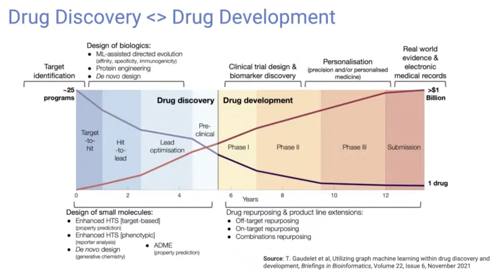

- Drug discovery: the early part (Hit identification ~ Pre-clinical phase)
- Drug development: the later part (Clinical trials phase 1 ~ Phase 4)
- Most ML research is focused on the **Drug discovery** part, since there is a larger quantity of data available that is more convenient to input into a computer.

## Background bioactivity / ADMET modeling

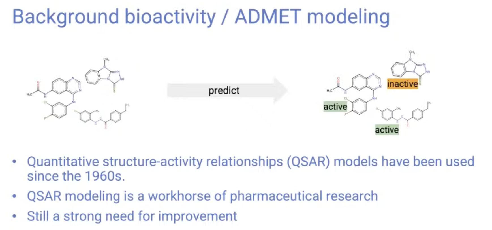

- Bioactivity modeling have been used since the 1960s.
- **[Research article] [Modeling Physico-Chemical ADMET Endpoints with Multitask Graph Convolutional Networks](https://www.mdpi.com/1420-3049/25/1/44) (Molecules, 2019)**
    
    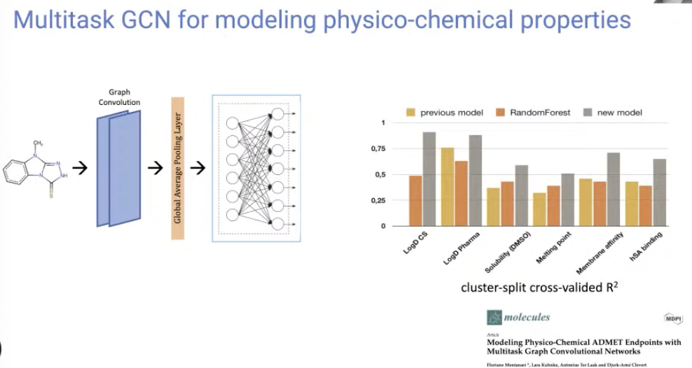
    
    - Multitask GCN for modeling physico-chemical properties.
    - Performed a molecular property prediction with GCN in multi-task setting.
    - This is an early work in this field using GNNs to predict properties.
- **[Research article] [Improving Molecular GCNs Explainability with Orthonormality and Sparsity](https://arxiv.org/abs/2105.04854) (ICML, 2021)**
    
    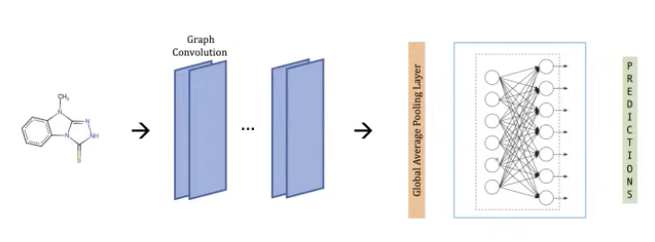
    
    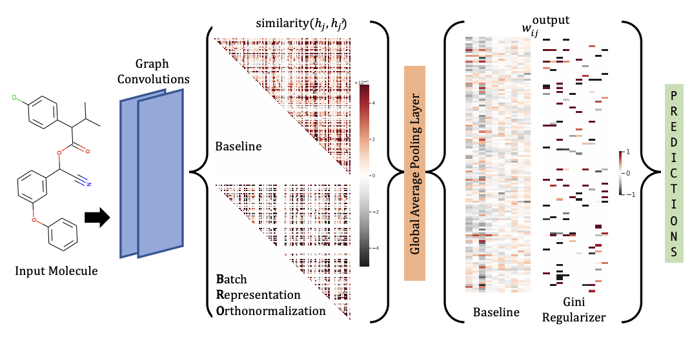
    
    - Proposed two regularization techniques to improve the accuracy and explainability.
        - Batch Representation Orthonormalization (BRO)
            
            → encourages graph convolution operations to generate orthonormal node embeddings.
            
        - Gini regularization
            
            → applied to the weights of the output layer and constrains the number of dimensions the model can use to make predictions.
            
    - Explainability results
        
        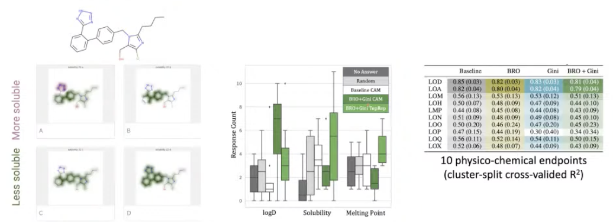
        
- **[Research article] [Representation Learning on Biomolecular Structures using Equivariant Graph Attention](https://openreview.net/forum?id=kv4xUo5Pu6) (LoG, 2022)**
    
    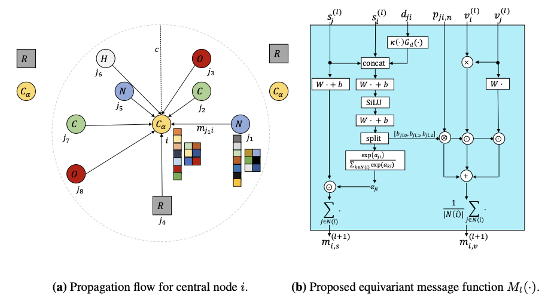
    
    - Let’s not focus only on invariant feature, but on **equivariant** feature.
    - EQGAT operates with Cartesian coordinates to incorporate directionality and is implemented with a novel attention mechanism, acting as a content and spatial dependent filter when propagating information between nodes.
    - Performed well on large biomolecule dataset (ATOM3D), and it is efficient.
        
        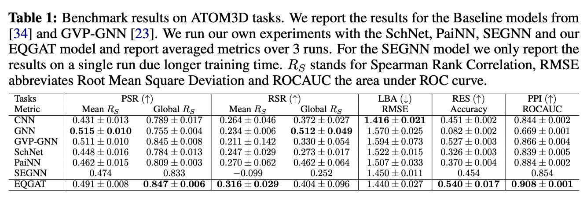
        

## The Diversity of Data in Drug Discovery

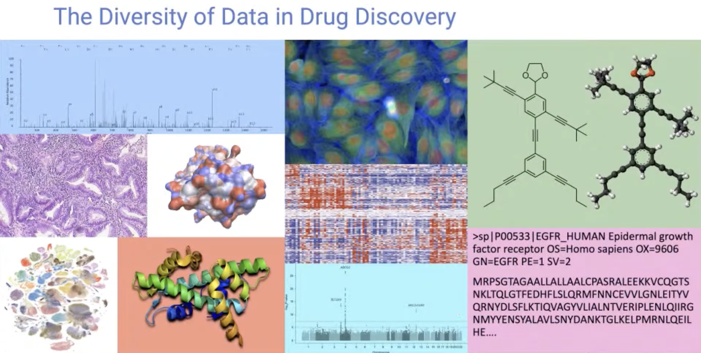

- There are many types of data in molecule domain, including various spectrometry data, graph, sequence, image, 3D point clouds, …

## Molecular Representations for Drug Discovery

- **[Research article] [Learning continuous and data-driven molecular descriptors by translating equivalent chemical representations](https://pubs.rsc.org/en/content/articlelanding/2019/sc/c8sc04175j) (Chemical Science, 2019)**
    
    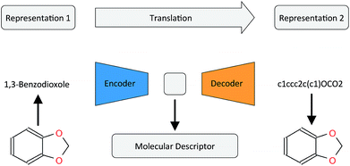
    
    - To learn molecule representation, authors made a autoencoder model that translates any SMILES into canonical SMILES. It was good for predicting downstream tasks.
    - Performance results
        
        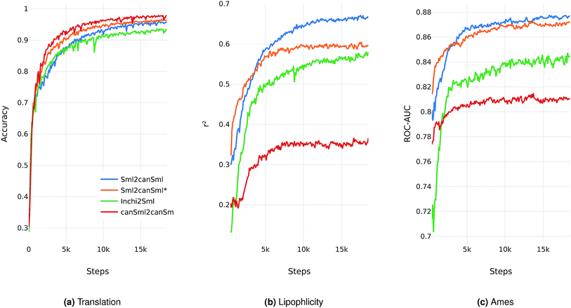
        
- **[Research article] [Efficient multi-objective molecular optimization in a continuous latent space](https://pubs.rsc.org/en/content/articlelanding/2019/sc/c9sc01928f) (Chemical Science, 2019)**
    
    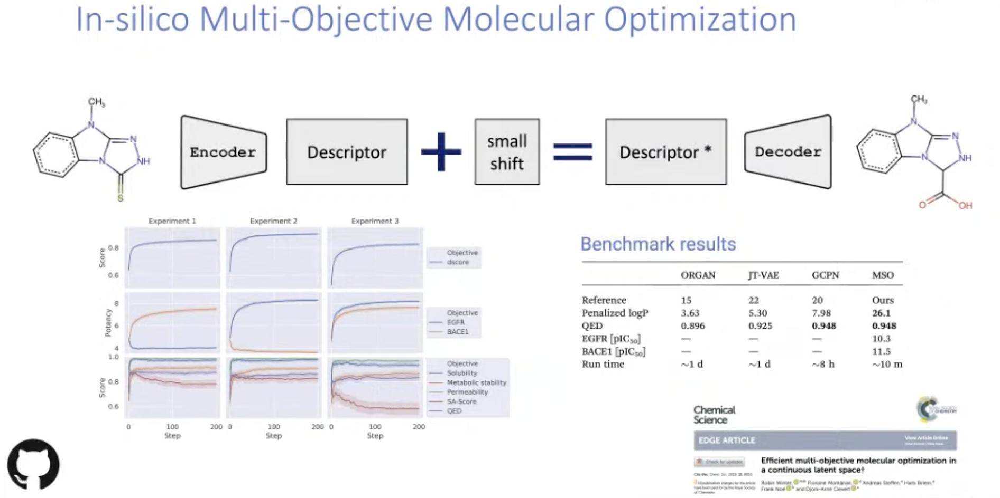
    
    - This method takes a starting compound as input and proposes new molecules with more desirable (predicted) properties.
    - Objective function combines multiple *in silico* prediction models, defined desirability ranges and substructure constraints.

## Conditional Molecular de novo Hit Design

- **[Research article] [De novo generation of hit-like molecules from gene expression signatures using artificial intelligence](https://www.nature.com/articles/s41467-019-13807-w) (Nature Communications, 2020)**
    
    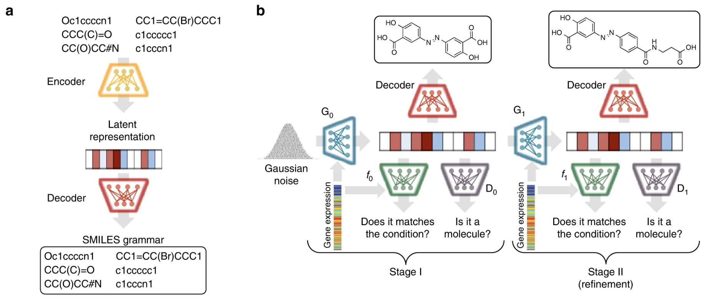
    
    - A generative model (GAN) that bridges systems biology and molecular design, conditioning a generative adversarial network with transcriptomic data.
    - When the model is provided with the desired state of gene expression signature, it is able to design active-like molecules for desired targets without any previous target annotation.
- **[Research article] [Cell morphology-guided *de novo* hit design by conditioning GANs on phenotypic image features](https://pubs.rsc.org/en/content/articlelanding/2023/dd/d2dd00081d) (Digital Discovery, 2023)**
    
    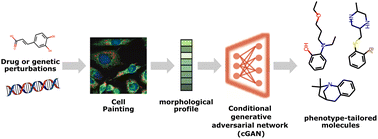
    
    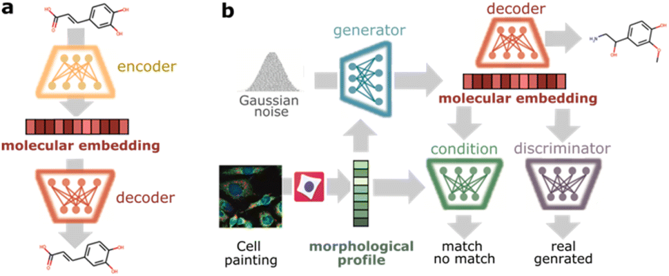
    
    - Utilized cellular morphology (cell painting morphological profiles) to directly guide the de novo design of small molecules. Authors used conditional GAN as a generative model.

## Inverse Molecular problems

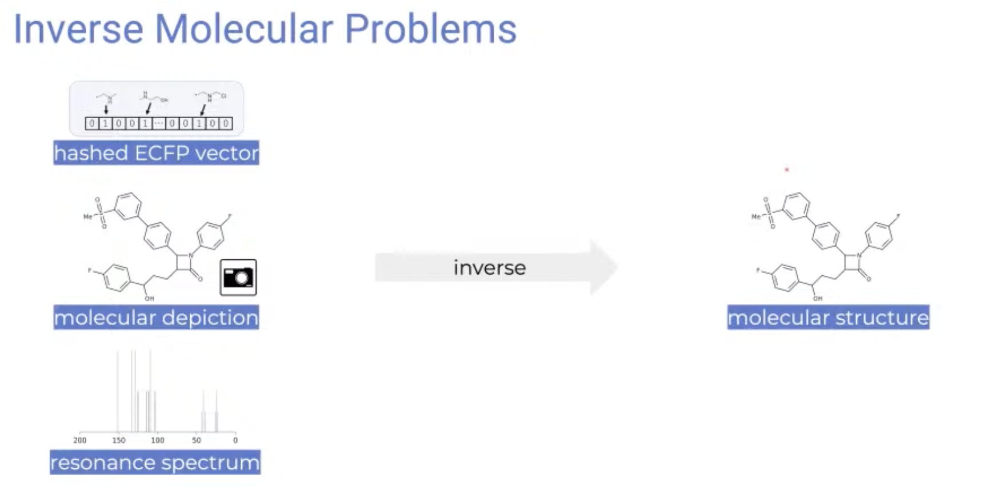

- Is it possible to inverse fingerprint, molecular depiction, or resonance spectrum into a molecule structure?
- **[Research article] [Neuraldecipher – reverse-engineering extended-connectivity fingerprints (ECFPs) to their molecular structures](https://pubs.rsc.org/en/content/articlelanding/2020/sc/d0sc03115a) (Chemical Science, 2020)**
    
    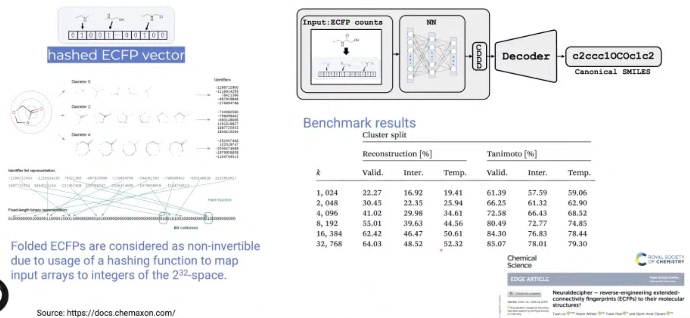
    
    - Since ECFP representation is made with hash function, they are often non-invertible.
    - Neuraldecipher is a neural net model that predicts a compact vector representation of compounds, given ECFPs.
    - Then utilize another pre-trained model to retrieve the molecular structure as SMILES representation.
    - This model were able to correctly deduce up to 69% of molecular structures.
- **[Research article] [Img2Mol – accurate SMILES recognition from molecular graphical depictions](https://pubs.rsc.org/en/content/articlelanding/2021/sc/d1sc01839f) (Chemical Science, 2021)**
    
    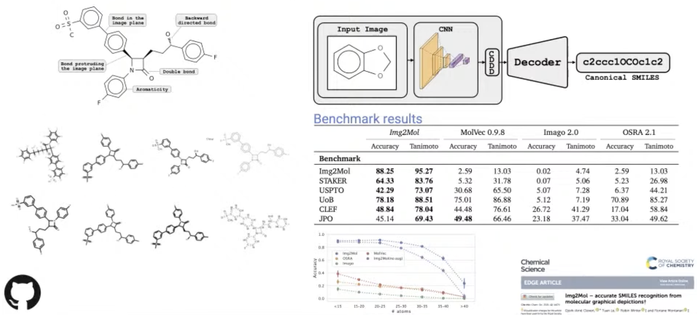
    
    - This model use CNN for molecule depictions and a pre-trained decoder that translates the latent representation into the SMILES representation of the molecules.
    - Img2Mol was able to correctly translate up to 88% of the molecular depictions into SMILES.

## Learning Graph level representation

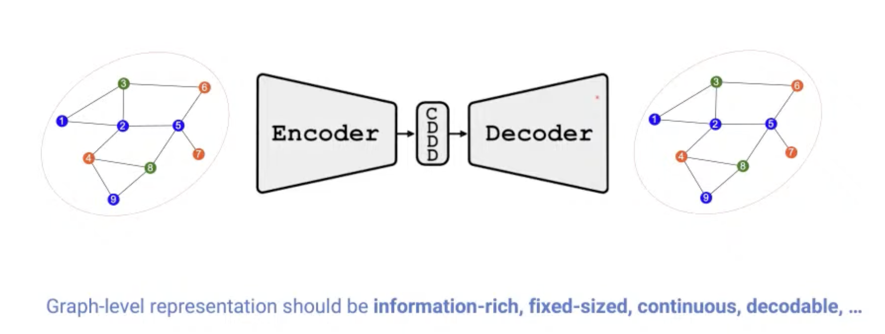

- **[Research article] [Permutation-Invariant Variational Autoencoder for Graph-Level Representation Learning](https://arxiv.org/abs/2104.09856) (NeurIPS, 2021, Poster)**
    
    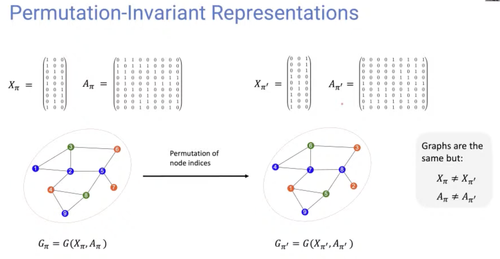
    
    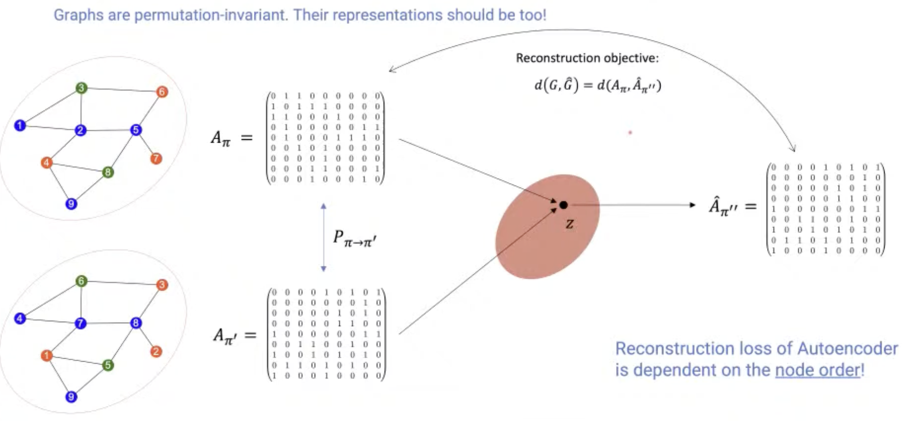
    
    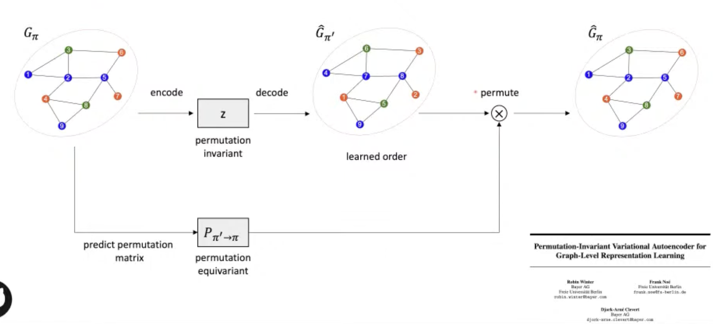
    
    - Graph representation is highly complexed, which can be represented by $(\\#\text{ nodes})!$ equivalent adjacency matrices.
    - This model indirectly learns to match the node ordering of input and output graph, without imposing a particular node ordering or performing expensive graph matching.
    - Showed promising results in graph classification, generation, clustering, interpolation.

## Personal Opinion
- It was interesting to see what kinds of research is being performed in big pharmas.
- Big pharmas seem to be more interested in applying ML methods on small problems than creating state-of-the-arts techniques.
- Inverse molecular modeling seems interesting for me.

## References
- https://www.youtube.com/live/ouuxi5uW-JA?feature=share&t=8477