ICML, '17  
[Model-Agnostic Meta-Learning for Fast Adaptation of Deep Networks](https://arxiv.org/abs/1703.03400)

# Summary
- MAML is a general and model-agnostic algorithm that can be directly applied to a model trained with **gradient descent** procedure.
- MAML does not expand the number of learned parameters.
- MAML does not place constraints on the model architecture.

## Keywords

- Model agnostic
- Fast adaptation
- Optimization based approach
- Learning good model parameters

## Preliminaries
- Common Approaches of Meta-Learning and MAML
    
    ](Untitled.png)
    
    MAML is one of the most influential model of optimization-based approaches.
    
    ](Untitled1.png)

- A few terminologies of meta-learning problems
    
    ](Untitled2.png)
## Introduction
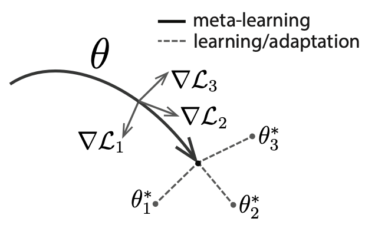

Goal of ideal artificial agent:

Learning and adapting quickly from only a few examples.

To do so, an agent must..

- Integrate its prior experience with a small amount of new information.
- Avoid overfitting to the new data.

→ Meta-learning has same goals.

MAML:

> "The key idea of MAML is to train the model's **initial parameters** such that the model has maximal performance on a new task after the parameters have been updated through one or more gradient steps computed with a small amount of data from that new task."
> 

Learning process of MAML:

MAML maximizes the sensitivity of the loss functions of new tasks.

Authors demonstrated the algorithm on three different model types.

- Few-shot regression
- Image classification
- Reinforcement learning

## 2. Model-Agnostic Meta Learning

### 2.1. Meta-Learning Problem Set-Up

To apply MAML to a variety of learning problems, authors introduce a generic notion of a learning task:

$\mathcal{T} = \{ \mathcal{L}(\mathbf{x}_1, \mathbf{a}_1, ..., \mathbf{x}_H, \mathbf{a}_H), q(\mathbf{x}_1), q(\mathbf{x}\_{t+1}|\mathbf{x}_t, \mathbf{a}_t), H \}$

Each task $\mathcal{T}$ consists of..

$\mathcal{L}$: a loss function, might be misclassification loss or a cost function in a Markov decision process

$q(\mathbf{x}_1)$: a distribution over initial observations

$q(\mathbf{x}\_{t+1}|\mathbf{x}_t , \mathbf{a}_t)$: a transition distribution

$H$: an episode length(e.g. in i.i.d. supervised learning problems, the length $H = 1$.)

Authors consider a distribution over tasks $p(\mathcal{T})$

Meta-training:

A new task $\mathcal{T}_i$ is sampled from $p(\mathcal{T})$.

The model is trained with only $K$ samples drawn from $q_i$.

Loss $\mathcal{L}\_{\mathcal{T}_i}$ is calculated and feedbacked to model.

Model $f$ is tested on new samples from $\mathcal{T}_i$.

The model $f$ is then improved by considering how the $test$ error on new data from $q_i$ changes with respect to the parameters. 

### 2.2. A Model-Agnostic Meta-Learning Algorithm

Intuition: Some internal representations are more transferrable than others. How can we encourage the emergence of such general-purpose representations?

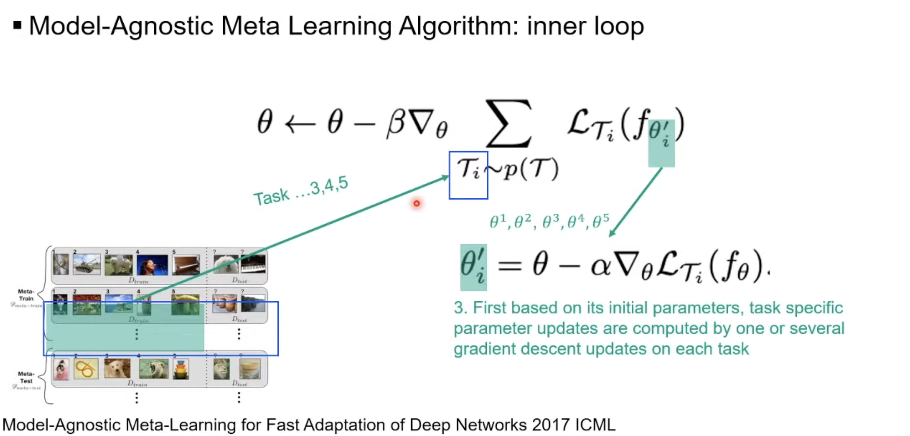

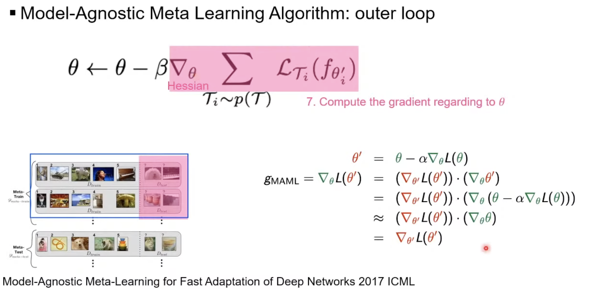

- A model $f_\theta$ has paramters $\theta$.
- For each task $\mathcal{T}_i$, $f\_\theta$'s parameters $\theta$ become $\theta_i'$.
- Algorithm
    
    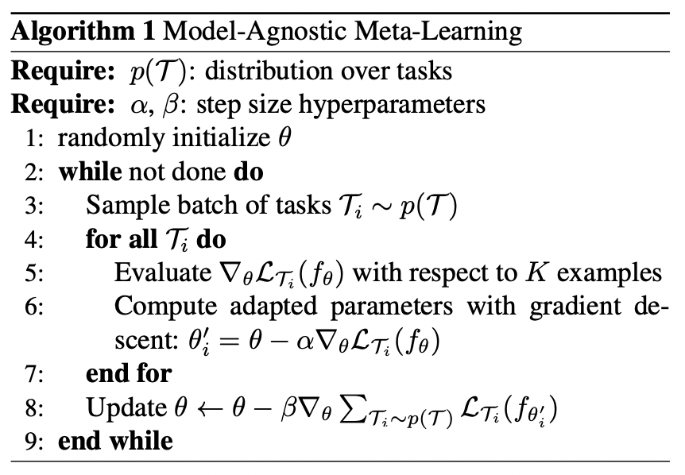
    
    - cf) Terminologies for below description(temporarily defined by JH Gu)
        
        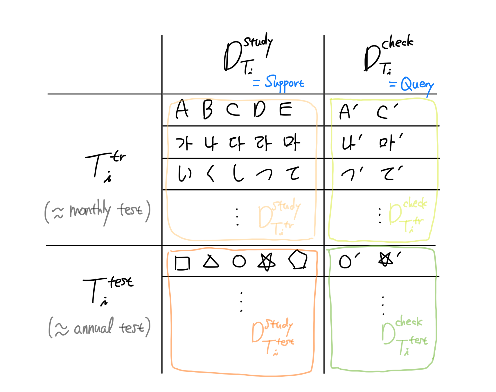
        
    - Divide tasks
        1. Separate tasks into meta-training task set($\{\mathcal{T}_i^{\text{tr}}\}$) and meta-test task set($\{\mathcal{T}_i^{\text{test}}\}$).
            
            (We can think of $\{\mathcal{T}_i^{\text{tr}}\}$ as monthly tests(모의고사), and $\{\mathcal{T}_i^{\text{test}}\}$ as annual tests(수능))
            
        2. For each task, divide each samples into $\mathcal{D}_{\mathcal{T}_i}^{\text{study}}$(task-specific samples for studying, also called as support set), $\mathcal{D}\_{\mathcal{T_i}}^{\text{check}}$(task-specific samples for checking, also called as query set)
            
            (We can think of $\mathcal{D}\_{\mathcal{T}_i}^{\text{study}}$ as 필수예제 in 수학의 정석, and $\mathcal{D}\_{\mathcal{T}_i}^{\text{check}}$ as 연습문제 in 수학의 정석)
            
    - Meta-training using meta-training task set $\{\mathcal{T}_i^{\text{tr}}\}$
        - Inner loop(task-specific $K$-shot learning)
            
            For each $\mathcal{T}_i$ in $\{\mathcal{T}_i^{\text{tr}}\}$, a new parameter $\theta_i'$ is created.
            
            1. Each $\theta_i'$ is initialized as $\theta$.
            2. With task-specific samples for studying($\mathcal{D}\_{\mathcal{T}_i^{\text{tr}}}^{\text{study}}$), each $\theta_i'$ is updated by:
                
                $$
                \theta_i' = \theta - \alpha \nabla_\theta \mathcal{L}\_{\mathcal{T}_i}(f\_\theta)
                $$
                
        - Outer loop(meta-learning across tasks)
            1. With task-specific samples for checking($\mathcal{D}\_{\mathcal{T_i}^{\text{tr}}}^{\text{check}}$), $\theta$ is updated by:
                
                $$
                \theta = \theta - \beta \nabla_\theta \sum\_{\mathcal{T}_i \sim p(\mathcal{T})}\mathcal{L}\_{\mathcal{T}_i} (f\_{\theta_i'})
                $$
                
                - cf) second-order derivative(Hessian) problem
                    
                    The MAML meta-gradient update(outer loop) involves a gradient through a gradient, which can be resource-intensive. This requires an additional backward pass through $f$ to compute Hessian vector products.
                    
                    $$
                    \begin{align*} \textcolor{red}{\theta'} &= \theta - \alpha \nabla_\theta \mathcal{L}(\theta) \\ \nabla_\theta \mathcal{L}(\textcolor{red}{\theta'}) &= (\textcolor{red}\nabla_{\textcolor{red}{\theta'}} \mathcal{L}(\textcolor{red}{\theta'})) \cdot (\nabla_\theta \textcolor{red}{\theta'}) \\ &= (\textcolor{red}\nabla_{\textcolor{red}{\theta'}} \mathcal{L}(\textcolor{red}{\theta'})) \cdot (\nabla_\theta (\theta - \alpha \nabla_\theta \mathcal{L}(\theta)) \\ &\approx (\textcolor{red}\nabla_{\textcolor{red}{\theta'}} \mathcal{L}(\textcolor{red}{\theta'})) \cdot (\nabla_\theta \theta) \\ &= (\textcolor{red}\nabla_{\textcolor{red}{\theta'}} \mathcal{L}(\textcolor{red}{\theta'})) \end{align*}
                    $$
                    
                    Authors included a comparison to drop the backward pass term and using just the first-order approximation, which showed not much difference.
                    
                    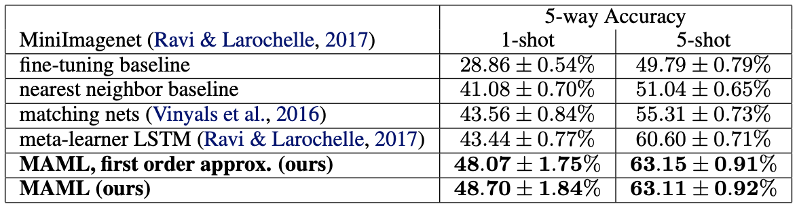
                    
    - Measure model performance using meta-test task set $\{\mathcal{T}_i^{\text{test}}\}$
        1. For each $\mathcal{T}_i$ in $\{\mathcal{T}_i^{\text{test}}\}$, adjust task-specific parameters with $\mathcal{D}\_{\mathcal{T}_i^{\text{test}}}^{\text{study}}$.
        2. Test the performance with $\mathcal{D}\_{\mathcal{T_i}^{\text{test}}}^{\text{check}}$.

## 3. Species of MAML

### 3.1. Supervised Regression and Classification

- Algorithm
    
    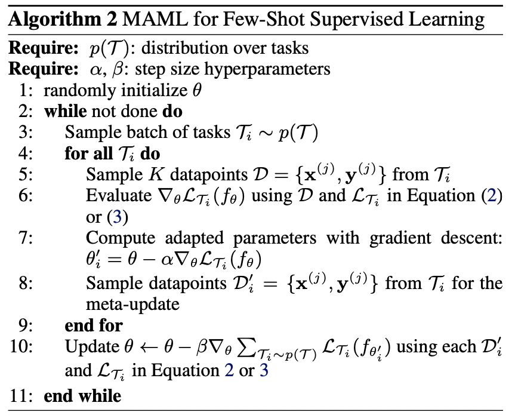
    
- Formalizing supervised regression and classification
    - Horizon $H = 1$
    - Drop the timestep subscript on $\mathbf{x}_t$ (since model accepts a single input and produces a single output)
    - The task $\mathcal{T}_i$ generates $K$ i.i.d. observations $\mathbf{x}$ from $q_i$
    - Task loss is represented by the error between the model's output for $\mathbf{x}$ and the corresponding target values $\mathbf{y}$.
- Loss functions
    - MSE for regression
        
        $$
        \mathcal{L}\_{\mathcal{T}_i}(f\_\phi) = \sum\_{\mathbf{x}^{(j)}, \mathbf{y}^{(j)} \sim \mathcal{T}_i} \| f\_\phi(\mathbf{x}^{(j)}) - \mathbf{y}^{(j)}\|^2_2
        $$
        
    - Cross entropy loss for discrete classification
        
        $$
        \mathcal{L}\_{\mathcal{T}_i}(f\_\phi) = \sum\_{\mathbf{x}^{(j)}, \mathbf{y}^{(j)} \sim \mathcal{T}_i} \big\\{ \mathbf{y}^{(j)} \log f\_\phi (\mathbf{x}^{(j)}) - (1-\mathbf{y}^{(j)})\log(1-f\_\phi(\mathbf{x}^{(j)}) \big\\}
        $$
        

### 3.2. Reinforcement Learning

- Algorithm
    
    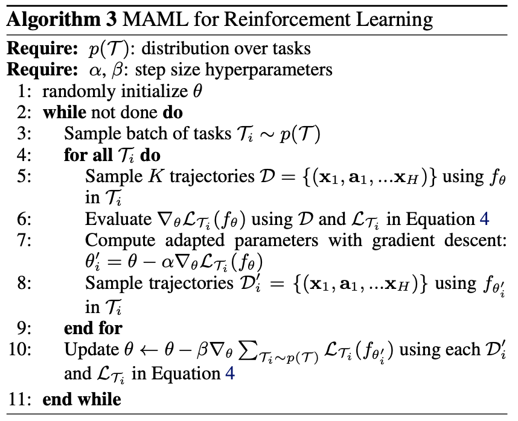
    
- Goal of MAML in RL:
    
    Quickly acquire a policy for a new test task using only a small amount of experience in the test setting.
    
- Formalizing RL
    
    Each RL task $\mathcal{T}_i$ contains..
    
    - Initial state distribution $q_i(\mathbf{x}_1)$
    - Transition distribution $q_i(\mathbf{x}_{t+1}|\mathbf{x}_t, \mathbf{a}_t)$
        - $\mathbf{a}_t$: action
    - Loss $\mathcal{L}_{\mathcal{T}_i}$, which corresponds to the negative reward function $R$
    
    Therefore, entire task is a Markov decision process(MDP) with horizon $H$
    
    The model being learned, $f_\theta$, is a policy that maps from states $\mathbf{x}_t$ to a distribution over actions $\mathbf{a}_t$ at each timestep $t \in \{ 1, ..., H\}$
    
- Loss function for task $\mathcal{T}_i$ and model $f\_\phi$:
    
    $$
    \mathcal{L}\_{\mathcal{T}_i}(f\_\phi) = -\mathbb{E}\_{\mathbf{x}_t, \mathbf{a}_t \sim f\_\phi, q\_{\mathcal{T}_i}} \bigg [ \sum\_{t=1}^H R_i(\mathbf{x}_t, \mathbf{a}_t) \bigg ]
    $$
    
- Policy gradient method
    
    Since the expected reward is generally not differentiable due to unknown dynamics, authors used policy gradient methods to estimate the gradient.
    
    The policy gradient method is an on-policy algorithm
    
    → There are additional sampling procedures in step 5 and 8.
    

## 4. Comparison with related works

Comparison with other popular approaches

- Training a meta-learner that learns how to update the parameters of the learner's model
    
    ex) On the optimization of a synaptic learning rule(Bengio et al. 1992)
    
    → Requires additional parameters, while MAML does not.
    
- Training to compare new examples in a learned metric space
    
    ex) Siamese networks(Koch, 2015), recurrence with attention mechanisms(Vinyals et al. 2016)
    
    → Difficult to directly extend to our problems, such as reinforcement learning.
    
- Training memory-augmented models
    
    ex) Meta-learning with memory-augmented neural networks(Santoro et al. 2016)
    
    The recurrent learner is trained to adapt to new tasks as it is rolled out.
    
    → Not really straightforward.
    

## 5. Experimental Evaluation

Three questions

1. Can MAML enable fast learning of new tasks?
2. Can MAML be used for meta-learning in multiple different domains?
3. Can a model learned with MAML continue to improve with additional gradient updates and/or examples?

### 5.1. Regression

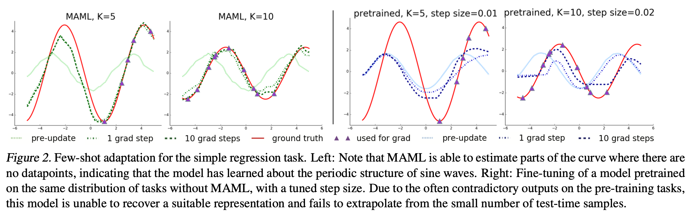

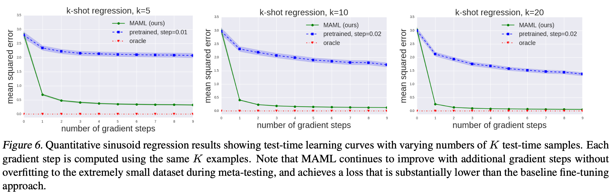

### 5.2. Classification

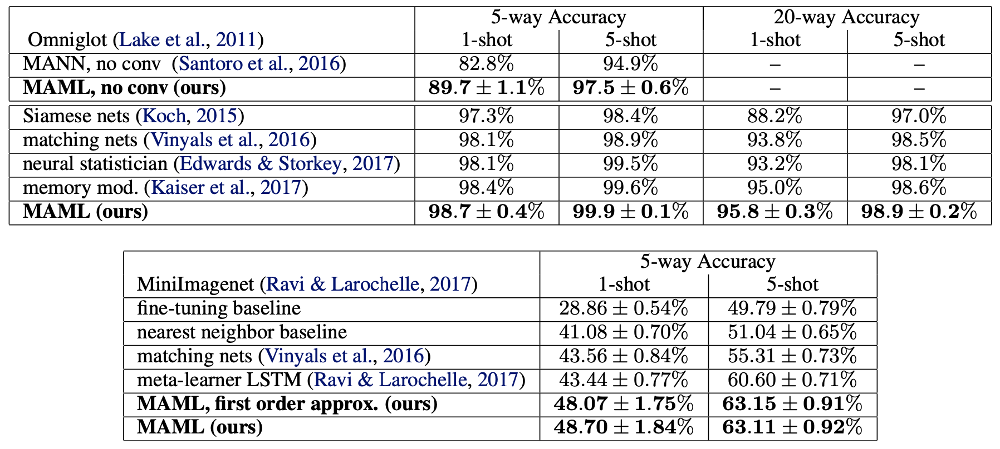

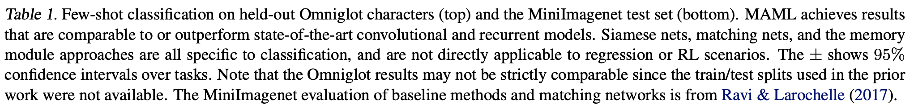

### 5.3. Reinforcement Learning

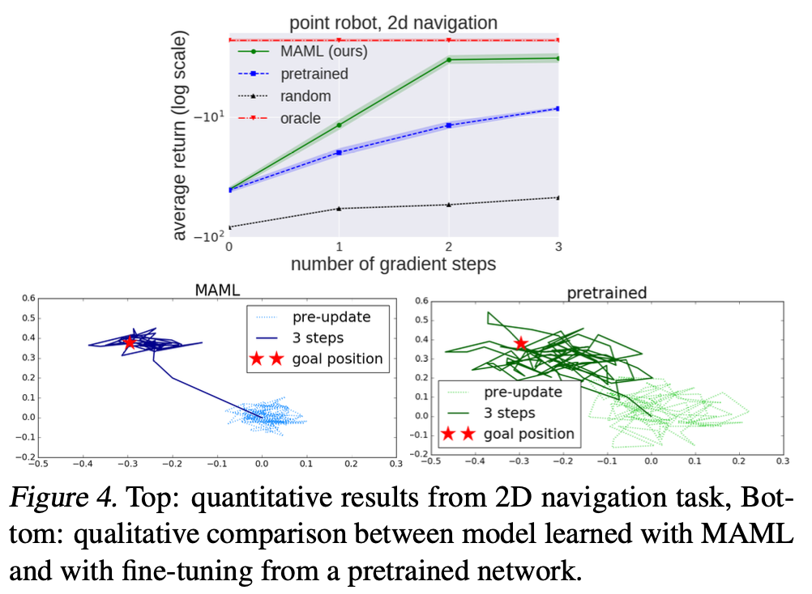

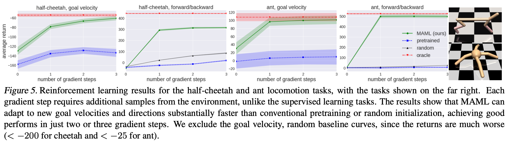

---

## References

[KAIST NeuroAI JC_#1 Meta Learning (편집본)](https://youtu.be/Izqod36syY8)

[https://ai.stanford.edu/~cbfinn/_files/dissertation.pdf](https://ai.stanford.edu/~cbfinn/_files/dissertation.pdf)

[[10주차] (MAML) Model-agnostic Meta Learning for Fast Adaptation of Deep Networks 논문 리뷰](https://velog.io/@tobigs_xai/10주차-MAML-Model-agnostic-Meta-Learning-for-Fast-Adaptation-of-Deep-Networks-논문-리뷰)

[Meta-Learning: Learning to Learn Fast](https://lilianweng.github.io/lil-log/2018/11/30/meta-learning.html)