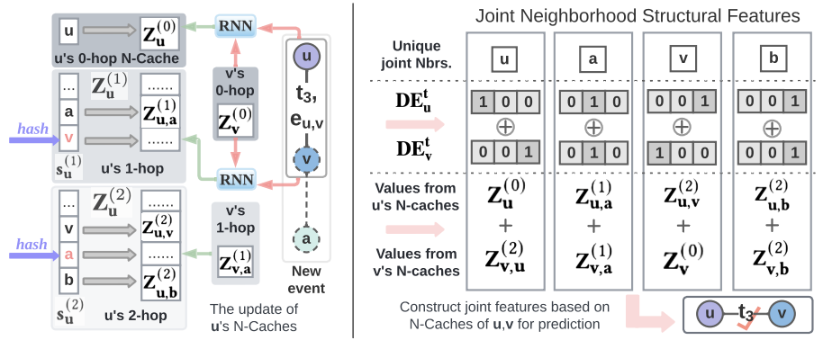
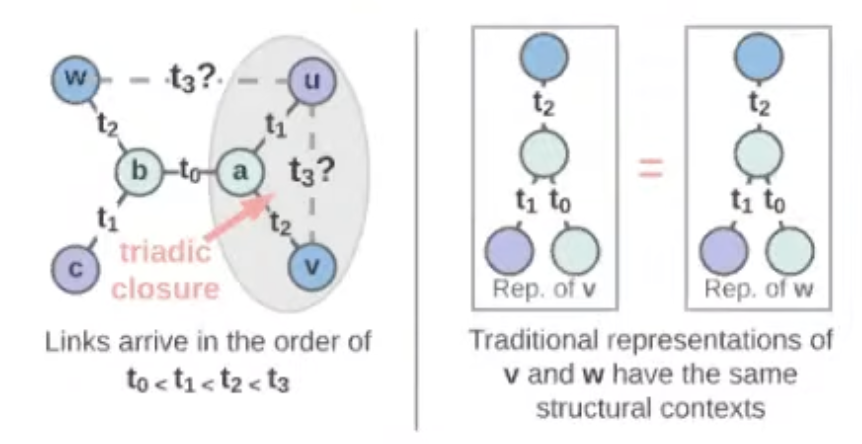
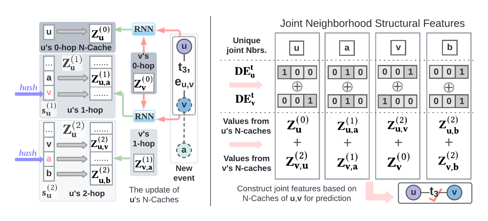
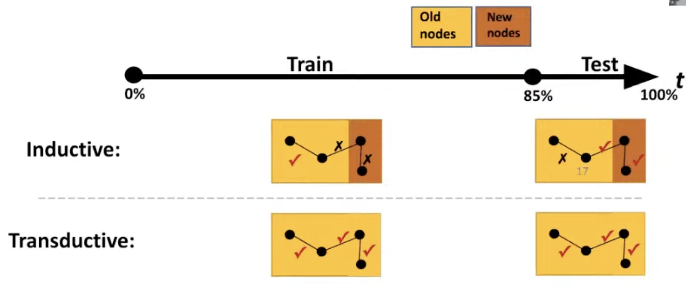
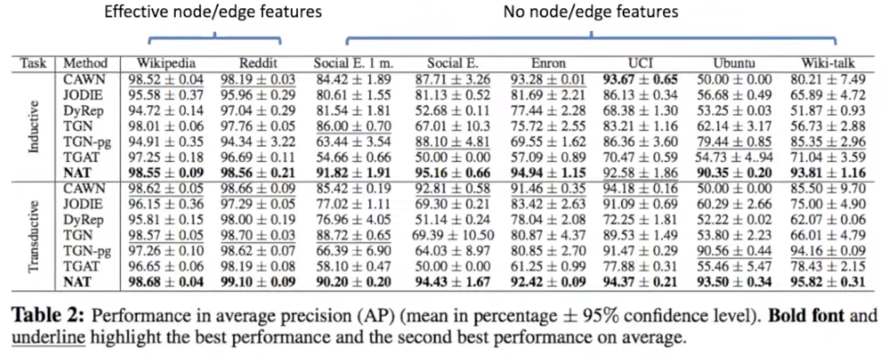

LoG, '22  
[Neighborhood-aware Scalable Temporal Network Representation Learning](https://arxiv.org/abs/2209.01084)

# Summary

- 시간에 따라 변하는 temporal network에 network science적인 inference를 잘 할 수 있는 모델들이 부족하다.
- 기존의 일반적인 GNN은 structural feature를 잘 반영하기 어렵고, node 간의 distance를 사용한 모델들도 대부분 static network에 적용하는 것이었다.
- Temporal network에 scalable하게 적용하는 방법으로 dictionary-type node representation과 neighborhood cache를 이용하여 다양한 link prediction task에서 좋은 성능을 달성했다.

## Temporal network

Temporal network는 시간에 따라 변하는, 복잡한 interactive system의 abstraction임.

네트워크 구조는 시간에 따라 변한다.

예시:

- 사용자-아이템 네트워크
- 소셜 미디어 네트워크
- 이메일 네트워크
- 모빌리티 네트워크 등

저자의 목표:

Temporal network가 어떻게 변할지 예측하여 link prediction을 수행하는 것.

적용 가능 분야:

- Recommendation
- Anomaly detection
- ...

## Network science에서 temporal network

- Network science는 네트워크 구조가 복잡한 시스템 하에서 어떻게 진화하고 변할지에 대한 기본적인 법칙을 연구하는 학문.
    
    예시:
    
    - Triadic closure in social network: 겹치는 친구가 있는 경우 서로 친구가 될 확률이 높다.
    - Feed-forward control: positive stimuli 뒤에는 negative stimuli가 따라온다.

## 선행 연구들

- 일반적인 GNN은 여러 node가 관여된 structural feature를 반영할 수 없음.
    - 예를 들어, triadic closure의 경우,
        
        
        
        timestep $t_3$에서 u와 v가 연결될지, $u$와 $w$가 연결될지 결정할 때, traditional GNN은 $w$와 $v$의 embedding을 동일하게 업데이트 한다. 즉, 두 node의 computation graph가 동일해서 구분하지 못 한다.
        
        → 이런 방법을 사용하면 network representation 이 잘 학습되지 않을 것이다.
        
- Static graph에서는 이 issue를 해결하기 위한 시도들이 존재.
    - SEAL (Zhang et al. 2018)
    - Distance encoding (Li et al. 2020)
    - Labeling trick (Zhang et al. 2021)
    - SUREL (Yin et al. 2022)
    - ELPH (Chamberlain et al. 2022)
    
    대부분의 key idea는 structural feature를 만들어서 extra feature로 사용하는 것.
    
    보통 shortest path distance를 사용.
    
    이런 idea를 temporal network에 effective하고 scalable하게 적용하는 것이 중요.
    
- Temporal network에 대한 최근 연구
    
    CAWN (Wang et al. 2021): computation overhead가 높다.
    
    1. 각 node pair마다 random walk이 sampling 되어야 한다.
    2. Relative positional encoding이 online으로 계산되어야 한다.
    

## Neighborhood Aware Temporal Network (NAT)

본 연구의 두 가지 특징

- Dictionary-type node representation
    
    구조적인 feature를 효율적으로 만들고, online neighbor sampling이 필요없다.
    
- Neighborhood caches (N-caches)
    
    Hashing을 parallel하게 진행해서 dictionary representation을 유지한다.
    

### Dictionary representation

- 굳이 long-vector representation을 사용하지 않는다.
- 각 node $u$가 dictionary로 표현된다.
    - Keys: 0-hop (self), 1-hop, 2-hop, … 관계에 있는 이웃들을 down-sampling 한 것
    - Values: short vector representation (2~8 dim)
        
    
    
    예시:
    
    
    
    → Node $u$와 $v$ 사이의 joint neighborhood 구조를 반영할 수 있다.
    
    
    
    → NAT는 전통적인 vector representation에서 쓰듯이 그냥 sum 등으로 representation을 aggregate 한다.
    
### NAT architecture
- Architecture
    

- Experiments
      
    Inductive & Transductive (node 기준) 모두 실험.

- Performance
    

- Computation & Scalability  
    
    
## Takeaways

- 여러 node의 joint neighborhood로부터 얻은 structural feature가 temporal network evolution에 중요하다.
- Dictionary-type representation은 structural feature 구성과 전통적인 vector representation을 모두 반영한다.
- Dictionary-type representation으로 online construction을 효율적으로 할 수 있다.

## Reference

[Neighborhood-aware Scalable Temporal Network Representation Learning](https://arxiv.org/abs/2209.01084)

[Learning on Graphs Conference 2022 - Day 1 Livestream](https://www.youtube.com/live/wp5S9GHyAgw?feature=share&t=8409)