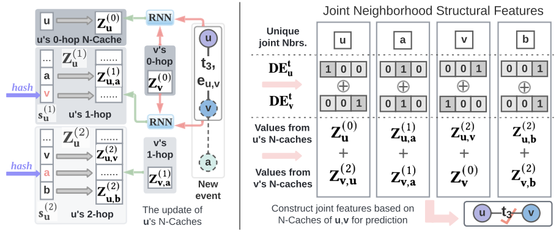
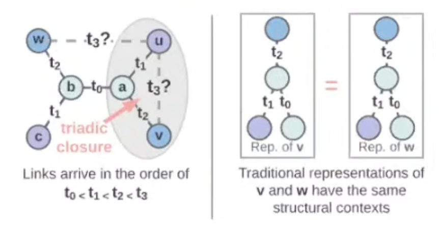
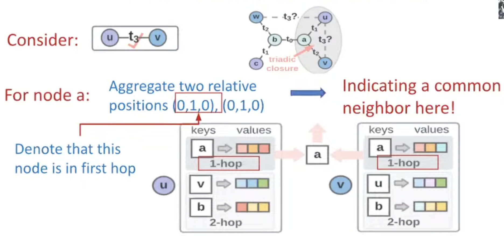
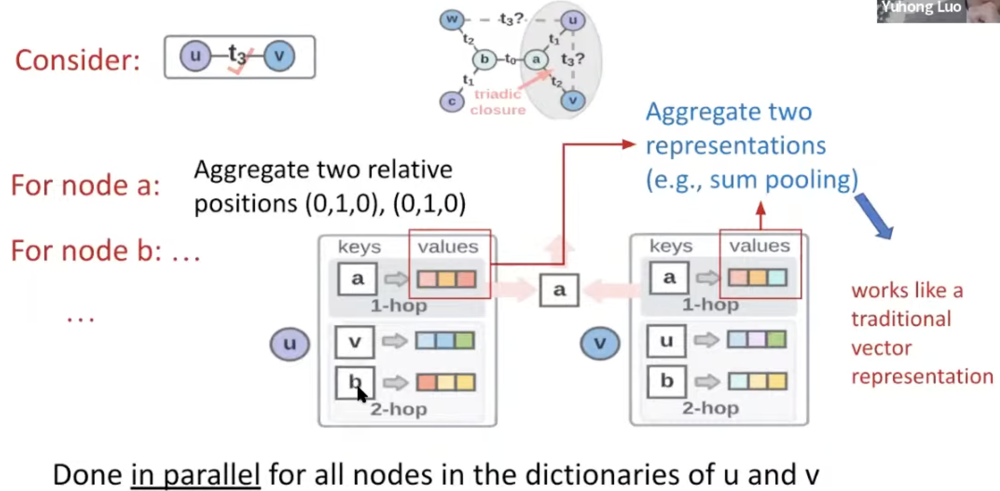
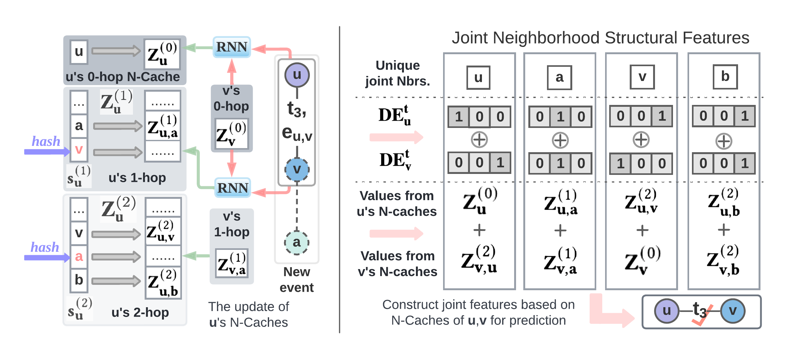
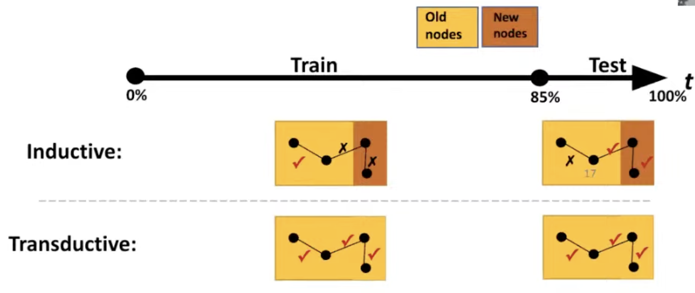
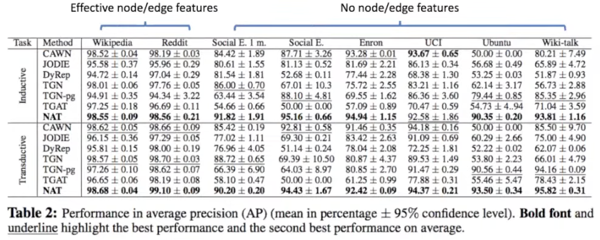
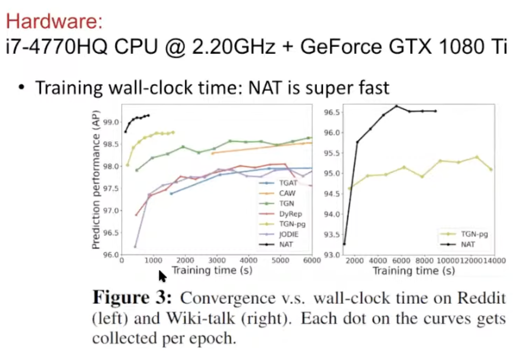

LoG, '22  
[Neighborhood-aware Scalable Temporal Network Representation Learning](https://arxiv.org/abs/2209.01084)

# Summary
    
- There are few models to infer network-scientific properties on time-varying temporal network.
- Traditional GNNs cannot deal with structural features, and most of the existing works used distance between nodes on static networks.
- Authors proposed dictionary-type node representation and neighborhood cache as a scalable way to represent temporal networks, and achieved SOTA performance on many link prediction tasks.

## Temporal Network

Temporal network is an abstraction of complex interactive systems.

Network structures evolve over time.

- Examples:
    - User-item network
    - Social media network
    - Email network
    - Engineering control networks
    - Mobility networks

Goal:

Predicting how temporal networks evolve → link prediction in temporal networks

Application:

recommendation, anomaly detection, …

## Temporal networks in network science

- Network science: how network structures evolves reflects the fundamental laws of these complex systems
    - Triadic closure in social network: people with common friends tend to know each other.
    - Feed-forward control in biological/engineering control systems: positive stimuli are followed with negative stimuli.

## Issues of Previous Approaches (Effectiveness)

- GNNs cannot capture structural features that involve multiple nodes of interest, such as triadic closure.
    
    
    
    At time step $t_3$, it is hard for traditional GNN to distinguish nodes $w$ and $v$, since their computation graphs are same.
    
    → Temporal network representation learning, if following traditional GNN-type computation, will fail to learn such information.
    
- Works over static graph
    
    There were some works to deal with this issues on static graphs.
    
    - SEAL (Zhang et al. 2018)
    - Distance encoding (Li et al. 2020)
    - Labeling trick (Zhang et al. 2021)
    - SUREL (Yin et al. 2022)
    - ELPH (Chamberlain et al. 2022)
    
    Most of the idea is to build structural feature (usually shortest path distance) and use it as extra feature.
    
    How can we apply this idea to temporal networks, in an efficient and scalable way?
    
- Recent work over temporal networks
    
    CAWN (Wang et al. 2021): but high computation overhead.
    
    1. For each queried node pair, random walks need to be sampled.
    2. The relative positional encoding needs to be computed online.

## Neighborhood Aware Temporal Network (NAT)

Key ideas

- Dictionary-type node representations
    - Constructs structural feature efficiently
    - Avoids online neighbor sampling
- Neighborhood Caches (N-caches)
    - Maintains dictionary representations with parallel hashing scalably

### Dictionary representations

- Do not use long-vector representations
- Each node u is represented as a dictionary
    - Keys: Down-sampled neighbors in 0-hop (self), 1-hop, 2-hop, …
    - Values: Short vector representations (2~8 dim)
        - representation for node $a$ as a neighbor of node $u$
    
    
    
    → Captures joint neighborhood structural features between $u$ and $v$
    
    
    
    → NAT combines structural feature construction and traditional vector representations
    
### NAT architecture
- Architecture
    

- Experiments
    
    Performed on both inductive & transductive setting.

- Performance
    

- Computation & Scalability
    

## Takeaways

- Structural features from a joint neighborhood of multiple nodes are crucial to predict temporal network evolution
- Dictionary-type representations can combine structural feature construction with traditional vector representations.
- Dictionary-type representations allow online construction of such structural features in an efficient way.

## Reference

[Neighborhood-aware Scalable Temporal Network Representation Learning](https://arxiv.org/abs/2209.01084)

[Learning on Graphs Conference 2022 - Day 1 Livestream](https://www.youtube.com/live/wp5S9GHyAgw?feature=share&t=8409)