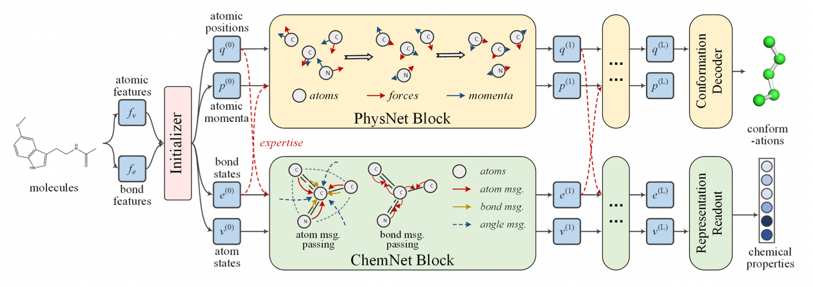
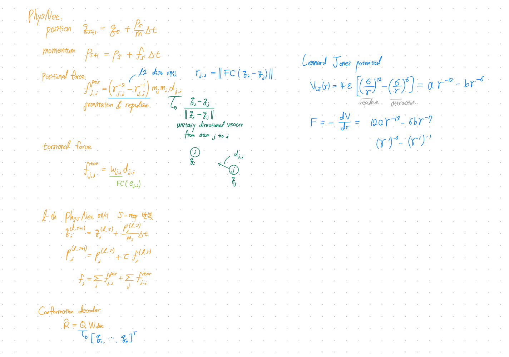
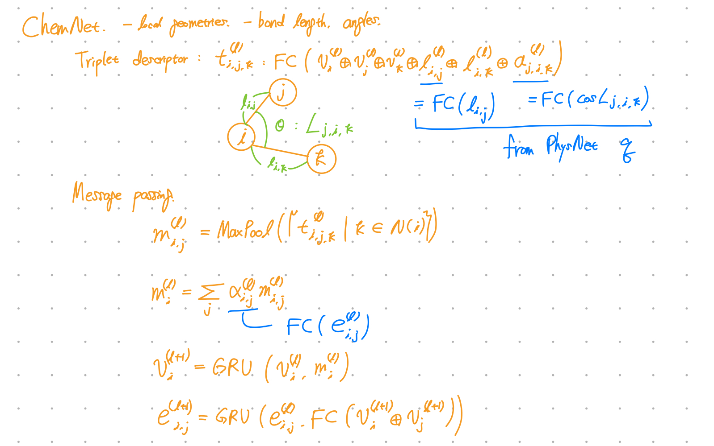

NeurIPS Poster, '21,  
<https://arxiv.org/abs/2112.04624>

# Summary
- Used physicist network (PhysNet) and chemist network (ChemNet) simultaneously, and each network shares information to solve individual tasks.
- PhysNet: Neural physical engine. Mimics molecular dynamics to predict conformation.
- ChemNet: Message passing network for chemical & biomedical property prediction.
- Molecule without 3D conformation can be inferred during test time.

## Preliminaries
- Molecular representation learning:  
    Embedding molecules into latent space for downstream tasks.
    
- Neural Physical Engines  
    Neural networks are capable of learning annotated potentials and forces in particle systems.  
    HamNet proposed a neural physical engine that operated on a generalized space, where positions and momentums of atoms were defined as high-dimensional vectors.
    
- Multi-task learning  
    Sharing representations for different but related tasks.
    
- Model fusion  
    Merging different models on identical tasks to improve performance.

## Notation
Graph $\mathcal{M} = (\mathcal{V}, \mathcal{E}, n, m, \mathbf{X}^v, \mathbf{X}^e)$  
- $\mathcal{V}$: set of $n$ atoms  
- $\mathcal{E}$: set of $m$ chemical bonds  
- $\mathbf{X}^v \in \mathbb{R}^{n \times d_v} = (x^v_1, ..., x^v_n)^\top$: matrix of atomic features  
- $\mathbf{X}^e \in \mathbb{R}^{m \times d_e} = (x^e_1, ..., x^e_m)^\top$: matrix of bond features

## Model

Figure 1. PhysChem Architecture

- Initializer
    - Input: atomic features, bond features (from RDKit)
    - Layer: fully connected layers
    - Output:
    - bond states, atom states for ChemNet  
        $v^{(0)}_i = \text{FC}(x^v_i), i\in \mathcal{V}$  
        $e^{(0)}\_{i,j} = \text{FC}(x^e\_{i,j}), (i, j)\in \mathcal{E}$
    - atom positions, atomic momenta for PhysNet  
        Bond strength adjacency matrix  
        $$A(i,j)=\begin{cases}0, & \text{if $(i,j) \notin \mathcal{E}$} \\\\ \text{FC}_{\text{sigmoid}}(x^e\_{i,j}), & \text{if $(i,j) \in \mathcal{E}$} \end{cases}$$
        $\tilde{V} = \text{GCN}(A, V^{(0)})$  
        $\{ (q^{(0)}_i \oplus p^{(0)}_i)\}  = \text{LSTM}(\{\tilde{v}_i\}), i \in \mathcal{V}$

- PhysNet
    - PhysNet is inspired by [HamNet](https://openreview.net/forum?id=q-cnWaaoUTH).  
    HamNet showed that neural networks can simulate molecular dynamics for conformation prediction.  
    - Directly parameterize the forces between each pair of atoms.  
    - Consider the effects of chemical interactions(e.g. bond types) by cooperating with ChemNet’s bond states.  
    - Introduces torsion forces.  
    - Output: 3D conformation
    
- ChemNet
    - ChemNet modifies MPNN(message passing neural network) for molecular representation learning.  
    - Output: Molecule representation
    

## Loss
- $L_{\text{phys}}$: Conn-k loss for Conformation prediction (PhysNet)
    
    $k$-hop connectivity loss
    
    $L_{\text{Conn}-k}(\hat{\mathbf{R}}, \mathbf{R}) = \|\frac{1}{n} \hat{\mathbf{C}}^{(k)} \odot (\hat{\mathbf{D}} - \mathbf{D}) \odot (\hat{\mathbf{D}} - \mathbf{D}) \|_{F}$
    
    $\odot$: element-wise product
    
    $\| \cdot \|$: Frobenius norm
    
    $(\hat{\mathbf{D}} - \mathbf{D})$ : distance matrix of the real and predicted conformations $(\hat{\mathbf{R}} - \mathbf{R})$ 
    
    $\hat{\mathbf{C}}^{(k)}$: normalized $k$-hop connectivity matrix
    
- $L_{\text{chem}}$: MAE or Cross entropy loss for Property prediction (ChemNet)
- Total loss
    
    $L_{\text{total}} = \lambda L_{\text{phys}} + L_{\text{chem}}$

---
Checkpoints

- Is Conn-k loss generally used in other conformation prediction models?
    
    No! But seems related to local distance loss.
    
- Is triplet descriptor generally used in other models?
    
    No!